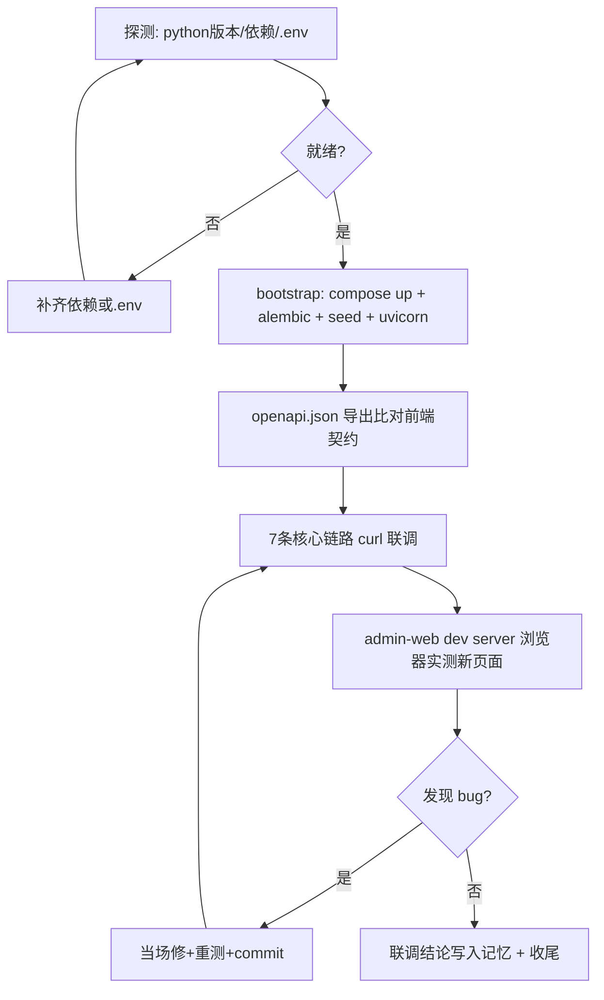

## 用户需求

用户确认下一步优先做 **M1 真联调验证**，且本机 **有 Docker Desktop**。本次实现 sprint（commit dd9c11b）已完成并通过静态校验（py_compile / admin-web tsc / mp-taro tsc），但仅静态校验、未真联调。目标是消除"伪完成"风险：实际起运行时环境、跑通本次新增/修改的核心链路、暴露并修复接口假设错误、验收成果。

## 产品概述

在已具备 Docker Desktop 的本机，通过 bootstrap 脚本一键起依赖（PG/Redis/Mongo/CH），迁移并种子化数据库，启动后端，随后用 Swagger + curl + dev-token 实测本次改动涉及的 7 条核心链路；admin-web 前端用 dev server 浏览器实测新页面能否真实拉取数据；mp-taro 因 Node24 与 Taro3 不兼容仅验证 API 层（不打包真机）。联调中发现的前端契约/后端 bug 当场修复并提交。

## 核心特性

- 环境探测与准备：探测本机 Python 版本、是否已 `pip install -e .`、`.env` 是否存在，缺则补齐（bootstrap 脚本健壮性加固）。
- 起运行时：docker compose up 依赖 → 等待 PG 健康 → alembic upgrade head → seed → 启动 uvicorn 后端。
- 契约实测 7 条链路：B1 医师审核、B2 合规提交、B3 处方审核工作台（pending_audit）、R4 处方药凭方下单、新后台页端点（/ih/users、/ih/consultations、/ih/schedules）、小程序主链路 API（开方/处方详情/凭方下单）、审计链 reviewer_id 正确性。
- 前端实测：admin-web `npm run dev` 起本地服务，浏览器验证 5 个新页面（患者/订单/问诊/排班/处方审核）与 plat CRUD 能否真实加载数据。
- 问题闭环：以 `localhost:8000/openapi.json` 为事实源，发现契约漂移或 bug 当场修、重测、提交；联调结论写入工作记忆。

## 技术栈选型

- 后端运行：Python（>=3.11，项目 pyproject 要求）+ FastAPI/uvicorn + SQLAlchemy 2.x（已装 egg-info，大概率 `pip install -e .` 已过）
- 依赖编排：Docker Desktop + `docker compose`（infra/docker-compose.yml 已含 PG/Redis/Mongo/CH/MinIO/Jaeger/Prometheus/Grafana）
- 数据库迁移：alembic（code/backend/alembic.ini + alembic/）
- 种子：app.db.seed.seed_all（code/backend/app/db/seed.py）
- 前端实测：admin-web `npm run dev`（React+AntD Pro，本地 3000 端口，vite proxy 到 8000）；mp-taro 仅 curl 验证 API（不打包）
- 验证工具：Swagger `/docs`、curl、dev-token（前端 login 用 /auth/dev-token 签发 JWT，role+sub）

## 实现方法

采用"探测 → 起环境 → 契约联调 → 前端实测 → 闭环修复"的顺序，避免盲目执行 bootstrap 后卡在未知环境问题上。

### 关键技术决策

1. **前置探测优先**：先确认 Python 版本、依赖是否装好、`.env` 是否缺失。理由：此前探索明确"本地是否 pip install -e . / 能否 alembic 命令未知"，盲目跑 bootstrap 会浪费时间在模糊报错上；探测 1 条命令即可定调。
2. **以 openapi.json 为唯一事实源**：联调时 `curl localhost:8000/openapi.json` 导出，与前端 service 路径/字段逐条比对，发现漂移当场修。理由：R1 风险（无 openapi.yaml，前端照 PRD 猜）是本次最大隐患。
3. **dev-token 模拟多角色**：用 `/auth/dev-token`（role=platform, sub=uid）拿 JWT 测 B1/B3 等需 platform 权限的端点，避免真登录流程阻塞。
4. **前端分而治之**：admin-web 可 dev server 真实点测；mp-taro 因 Node24 打包崩溃只验 API 层（端点已 tsc 通过），真机预览留待切 Node18/20。理由：控制联调范围、聚焦后端契约正确性。
5. **失败即修即提**：联调暴露的 bug（契约/逻辑/枚举）当场修、重测、commit 推送，保证仓库始终处于"已验证"状态。

### 性能与可靠性

- compose 起依赖是一次性成本（~1-2min 拉镜像），后续 uvicorn 热重载；alembic/seed 幂等可重跑。
- 联调用脚本化 curl 批量验证（而非手工点），结果可复现、可写入报告。
- 不引入新依赖/新架构，沿用现有 bootstrap.ps1 与 dev-token 机制。

## 实现注意（防回归）

- **勿整文件覆盖**：改 service/页面前必 read 确认已存在内容（此前曾误覆盖 ih.ts 致 TS2305）。
- **枚举单一来源**：联调若发现 pending/pending_audit 仍不一致，统一到后端 schema；不在前端散落硬编码。
- **审计链正确**：审核接口 reviewer_id 必须取当前 JWT 用户（R5 已修），联调时查 audit 表确认非写死 1。
- **敏感信息**：`.env` 仅本地、不入库（已 gitignore）；联调日志不得打印 JWT_SECRET。
- **范围控制**：不实现支付/供应商真实接入（仍 mock）；不铺 R6 药师 RBAC 大改（除非联调暴露必须）。
- **环境副作用**：docker compose 起的容器与数据卷留在本地，联调后按需 `docker compose down -v` 清理，避免占盘。

## 架构设计

沿用现有分层，本次仅"运行 + 验证 + 修复"，不引入新架构。验证流：



## 目录结构与改动点

```
code/backend/
├── .env                         # [确认/补齐] 本地密钥与连接串（不入库）
├── app/main.py                 # [只读验证] 健康检查 /health 与 /docs 可用性
├── app/api/v1/ih/doctors.py    # [联调验证] B1 approve/reject 实际返回与审计
├── app/api/v1/ih/prescriptions.py # [联调验证] B3 pending_audit + R5 reviewer_id
├── app/api/v1/ih/orders.py     # [联调验证] R4 prescription_id 必传校验
├── app/api/v1/plat/compliance.py # [联调验证] B2 /submit
└── app/db/seed.py              # [运行] seed_all 幂等播种

code/infra/
├── docker-compose.yml          # [运行] 依赖编排（已就绪）
├── scripts/bootstrap.ps1       # [加固] 增加 .env 缺失检测与依赖检查提示
└── .env                        # [确认] 连接串（被 compose 引用）

code/admin-web/
├── src/services/ih.ts          # [联调比对] 与 openapi 路径/字段一致性
├── src/services/plat.ts        # [联调比对] B2 路径
└── src/routes/ih/*             # [浏览器实测] patients/orders/consultations/schedules/rx-review

code/mp-taro/src/services/ih.ts # [API 联调] 开方/订单/处方详情端点（不打包）
```

## 关键验证清单（curl 脚本化）

1. `GET /api/v1/ih/users` → 患者列表非空
2. `POST /api/v1/ih/doctors/{id}/approve` → status=approved + audit 有记录
3. `POST /api/v1/plat/compliance/submit` → 201/200
4. `GET /api/v1/ih/prescriptions?status=pending_audit` → 待审处方返回
5. `PATCH /api/v1/ih/prescriptions/{id}/audit` → reviewer_id=当前uid（非1）
6. `POST /api/v1/ih/orders` 不带 prescription_id(rx) → 422；带 → 200
7. `GET /api/v1/ih/consultations`、`GET /api/v1/ih/schedules` → 列表返回
8. `POST /api/v1/ih/prescriptions`（开方）、`GET /api/v1/ih/prescriptions/{id}` → 主链路

## Agent Extensions

### SubAgent

- **code-explorer**
- Purpose: 在联调前/修复时精确核对后端端点签名、前端 service 字段、alembic/seed 入口，避免误覆盖与契约漂移
- Expected outcome: 每次修改或比对都返回准确的现有代码结构与端点定义，保障改动精准、零回归