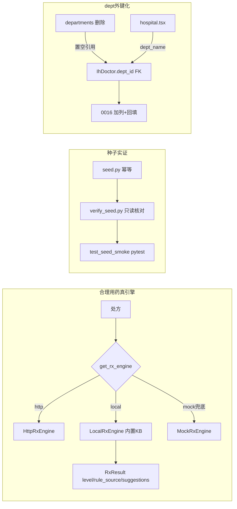

## 用户需求

用户确认：临时文件留到全部任务完成后统一清理（清理不影响数据，仅删本地输出文件），现在继续执行 P1 的 H4、H5、H6 三项代码级任务。

## 产品概述

在已完成 P0（H1 RLS 隔离、H2 DEV 建档后门）修复的基础上，补齐三项 P1 能力：合理用药真引擎、种子数据实证、医师科室外键化。三项均不依赖外部付费资源，纯后端 + 轻量前端改动，并配套可验证的测试/脚本。

## 核心功能

- H4 合理用药真引擎：用内置本地知识库增强引擎（LocalRxEngine）替代仅 4 条规则的 mock，覆盖真实临床常用药物相互作用、禁忌、重复用药、特殊人群（肝肾功能、孕期、哺乳期、儿童、老年）规则；保留 MockRxEngine 作降级基准、HttpRxEngine 作外部对接点；工厂按 http>local>mock 优先级选择，配置默认切到 local。
- H5 种子实证：实际运行 seed 并新增 verify_seed 自检脚本，核对关键表（门店、账号、platform_admin 双因子、P3 演示模块）已落地，并补 pytest 轻量冒烟测试（Postgres 不可达则 skip）。
- H6 医师科室外键化：IhDoctor.dept 字符串平滑迁移为 dept_id 外键关联 ih_department；新增迁移 0016 完成加列 + 按科室名回填 dept_id + 索引；模型/序列化/接口/前端联调同步更新，删除科室时处理医师引用。

## 技术栈选择

- 后端：Python 3.11 + FastAPI + SQLAlchemy 2.0 Async + Alembic（复用现有栈，无新增依赖）
- 测试：pytest + httpx（ASGI transport，复用 test_mt_compliance.py / test_p6_endpoints.py / test_rls_isolation.py 既定模式）
- 配置：Pydantic Settings（config.py），rx_engine_provider 默认改 "local"，新增可选 rx_engine_kb_path
- 前端：React + TypeScript（admin-web），仅 hospital.tsx 医师表格/筛选科室列改用 dept_name

## 实现方式

### 总体策略

三项相互独立、可分批提交，均复用现有工厂/迁移/测试范式，不改动 P0 已修复的 RLS/DEV 后门逻辑。

### 关键技术决策与理由

1. H4 引擎分层：base.py 抽象 `RxEngine.check()` 与 `RxResult`（扩展 level/rule_source/suggestions）；local.py 内置 Python 常量规则表（相互作用对、禁忌人群、重复用药同通用名、特殊人群告警），纯内存匹配，O(n) 遍历处方项，性能无瓶颈；mock.py 保留为最小基准；http.py 骨架契约不变。工厂 `__init__.py` 按 provider 返回实例，未知值回退 local。理由：零外部依赖即可让"真引擎"落地，且后续可外置 KB 为 JSON/DB。
2. H5 独立 verify_seed.py：不改动 seed.py 既有幂等逻辑（降低回归风险），新增 `app/db/verify_seed.py` 连库核对并返回报告；pytest 中 `test_seed_smoke.py` 复用 `_db_available()` 探测 + skip 约定。理由：实证与幂等职责分离，避免破坏现有 seed。
3. H6 外键平滑迁移：新增迁移 0016 加 `ih_doctor.dept_id` 列（nullable FK）+ 索引，并用 `UPDATE ... FROM ih_department WHERE name = dept` 回填（未匹配置 NULL，不强制约束）；模型加 dept_id，保留 dept 字符串作冗余过渡；departments 删除前将引用该科室的医师 dept_id 置 NULL。理由：历史数据不丢、外键不阻断删除、前端可按 dept_id 精确筛选。

### 实现要点（防回归）

- H4：prescriptions.py 调用方已降级，仅可选把 `rule_source` 透传响应；RxResult 新增字段向后兼容 mock/http。
- H5：verify_seed 只读查询，不改写数据；测试种子高位固定 id 区间与现有 seed 一致。
- H6：doctors.py / departments.py 路由改动用唯一上下文，改后 grep 复核落点（汲取 P0 雷同片段错位教训）；DoctorOut 增 dept_name（联表或二次查询），前端 hospital.tsx 改用 dept_name 展示与筛选。
- 不触碰 H1/H2 已修复代码；不引入新迁移以外的表结构变更（H4/H5 无迁移）。

## 架构设计



## 目录结构

```
code/backend/app/services/rx_engine/base.py        # [MODIFY] RxResult 扩展 level/rule_source/suggestions；check 契约稳定
code/backend/app/services/rx_engine/local.py       # [NEW] LocalRxEngine + 内置临床规则常量表（相互作用/禁忌/重复用药/特殊人群）
code/backend/app/services/rx_engine/mock.py        # [MODIFY] 标注为降级基准，逻辑保留
code/backend/app/services/rx_engine/http.py        # [MODIFY] 注释明确外部供应商对接点，契约不变
code/backend/app/services/rx_engine/__init__.py    # [MODIFY] 工厂支持 local/http/mock，优先 http>local>mock
code/backend/app/core/config.py                    # [MODIFY] rx_engine_provider 默认 "local"，新增 rx_engine_kb_path 可选
code/backend/.env.example                          # [MODIFY] 新增 RX_ENGINE_PROVIDER / RX_ENGINE_KB_PATH 说明
code/backend/tests/test_rx_engine.py               # [NEW] 覆盖冲突/禁忌/重复用药/特殊人群/降级
code/backend/app/db/verify_seed.py                 # [NEW] 连库只读核对关键实体并返回报告
code/backend/tests/test_seed_smoke.py              # [NEW] seed 幂等+关键实体存在（Postgres 不可达 skip）
code/backend/alembic/versions/0016_doctor_dept_fk.py  # [NEW] 加 dept_id 列 + 按 name 回填 + 索引
code/backend/app/models/ih_models.py               # [MODIFY] IhDoctor 加 dept_id FK(IhDepartment.id) nullable
code/backend/app/schemas/ih.py                     # [MODIFY] DoctorCreate/Update 加 dept_id 可选，DoctorOut 加 dept_name
code/backend/app/api/v1/ih/doctors.py              # [MODIFY] 写入/输出 dept_id 与 dept_name
code/backend/app/api/v1/ih/departments.py          # [MODIFY] 删除科室前将引用医师 dept_id 置空
code/admin-web/src/routes/ih/hospital.tsx          # [MODIFY] DoctorTab 科室列/筛选改 dept_name
code/backend/pytest_out.txt / rls_out.txt / alembic_out.txt  # [DELETE 最后阶段] 清理残留临时输出文件
```

## 关键代码结构

```python
# rx_engine/base.py
@dataclass
class DrugAlert:
    level: str            # "contraindication" | "interaction" | "duplicate" | "special_population" | "dose"
    rule_source: str      # "local_kb" | "mock" | "external"
    message: str
    suggestions: list[str]

@dataclass
class RxResult:
    ok: bool
    alerts: list[DrugAlert]
    raw: dict | None = None

# ih_models.py
class IhDoctor(Base):
    dept: str | None = mapped_column(String(32), nullable=True)   # 过渡冗余
    dept_id: int | None = mapped_column(ForeignKey("ih_department.id"), nullable=True, index=True)
```

## Agent Extensions

### SubAgent

- **code-explorer**
- Purpose: 在写代码前精查 H6 涉及的 doctors.py 全部路由签名、departments.py 删除逻辑、ih_models 中 IhDepartment 字段、以及 hospital.tsx 中 DeptTab/DoctorTab 的真实字段与接口调用，避免凭推断写错字段名或落点错位。
- Expected outcome: 产出 doctors.py/departments.py 路由精确清单、IhDepartment 列定义、前端科室字段与接口契约，作为 H6 编码的精确依据。