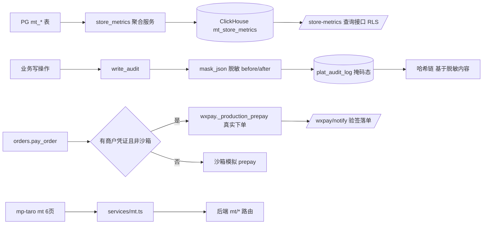

## 用户需求

执行 P2/P3 全量收口，一次性补齐 P1/P2/P3 剩余缺口：P2-CH 验证、P2-审计脱敏对齐、H3 支付生产化、S8 mt 小程序闭环。审计脱敏采用"落库前脱敏"——write_audit 写入前对 before/after_json 中身份证、手机号、姓名等敏感字段做掩码，哈希链仍基于脱敏后内容计算。

## 产品概述

当前平台 P0/P1 核心链路已落地，但存在 4 处收口缺口：ClickHouse 经营宽表仅写了服务/接口未真实验证；审计日志敏感字段明文落库不满足等保三级；微信支付仅 dev 沙箱占位未接真实下单；小程序 mt 中台域 6 页需与后端接口闭环核对。本次把四块缺口全部补齐并验证。

## 核心功能

- P2-CH 验证：确认 ClickHouse 真实建表 DDL 可用，store_metrics 聚合服务将 PG 门店指标按日幂等写入 CH，查询接口经 RLS 正常返回。
- P2-审计脱敏：write_audit 在落库前对 before/after_json 内身份证、手机号、姓名等敏感键做掩码，保证明文不入审计表，哈希链基于脱敏内容仍自洽。
- H3 支付生产化：orders.pay_order 在持有商户凭证时走真实微信下单与 JSAPI 签名，缺凭证安全降级（沙箱或抛错，不实际发请求）。
- S8 mt 小程序闭环：核对 mp-taro 的 6 个 mt 页面与 services/mt.ts 封装，对齐后端接口字段与调用方式，补齐未闭环入口（授权、AI 预测触发、NPS 录入等）。

## 技术栈选择

- 后端：FastAPI + SQLAlchemy 2.0 async + Alembic + PyJWT + Pydantic v2 + clickhouse-driver（沿用现有栈，无新依赖）。
- 前端：React + Ant Design Pro（admin-web，本次仅验证）；Taro（mp-taro 小程序，React 语法）。
- 验证：真实 uvicorn 子进程 + httpx 模式（禁用 TestClient）；`npx tsc --noEmit` 校验前端。

## 实现方法

### 总体策略

四项缺口相互独立，均复用既有模式（success/PageResult/write_audit/require_role/store_scope），零新增架构。按"验证->修复->测试"循环，每项改动后即时跑对应 pytest，避免回归。

### 关键技术决策

1. **CH 验证**：先确认 `clickhouse-driver` 是否已安装（docker ClickHouse 长期 healthy）。核对该 client 的 `ensure_store_metrics_table()` DDL 与 `store_metrics.py` 聚合写入字段一致；用临时脚本（放 backend 目录）真实建表 + 跑 `aggregate_store_metrics(昨天的日期, None)` + `query_store_metrics` 验证返回。不可达则跳过并标注，不阻塞主链路。
2. **审计脱敏**：在 `app/utils/mask.py` 新增 `mask_json(obj)` 递归遍历 dict/list，对键名命中敏感规则（id_card/phone/real_name/mobile/身份证/手机/姓名等，含嵌套）的值做掩码（身份证保留前 3 后 2、手机保留前 3 后 2、姓名保留首字）。`write_audit` 在 `compute_audit_hash` 前对 `before/after` 调 `mask_json`，保证哈希链基于脱敏内容。复用 models/schemas 已有 `*_mask` 字段语义，不重复定义脱敏规则。
3. **H3 支付**：`orders.pay_order` 改为 `if settings.wxpay_mch_id and not settings.wxpay_dev_sandbox: 走 wxpay._production_prepay`；否则保持沙箱返回。真实分支缺 appid/key 时 `_production_prepay` 已抛 RuntimeError，pay_order 捕获后统一错误模型返回（不崩主链）。`/wxpay/notify` 验签路径已就绪，仅补充真实商户号可用性的日志标注。
4. **S8 小程序**：用 [subagent:code-explorer] 扫描 `mp-taro/src/pages/mt/*` 与 `services/mt.ts`、`constants/api.ts`，逐项核对后端 `app/api/v1/mt/*` 路由的 path/方法/字段，输出未对齐清单（页面调用 vs 后端契约），再针对性修复页面或封装。

### 性能与可靠性

- CH 聚合幂等（按 date+store_id 覆盖写），查询接口缺数据返回空 PageResult，CH 失败仅告警不阻断。
- 审计脱敏为纯函数、O(n) 遍历，开销可忽略；递归深度受 JSON 结构限制无栈溢出风险。
- 支付真实分支失败降级，保障开方/下单主链路可用。
- 测试复用 uvicorn+httpx，避免 Windows 异步 event-loop 冲突。

## 实现要点（防回归）

- 复用既有 `success()`/`PageResult`/`write_audit`/`require_role`/`store_scope` 范式，不新建模式。
- CH 验证脚本放 backend 目录运行（sys.path 含 cwd），跑完即删临时脚本。
- 审计脱敏不影响既有 91+ 调用点（write_audit 签名不变，仅内部增强）。
- 支付改动仅影响 pay_order 分支选择，沙箱路径行为不变。
- 前端改动后 `npx tsc --noEmit` 须 0 错误。

## 架构设计



## 目录结构

```
code/backend/
├── app/
│   ├── utils/mask.py                 # [NEW] mask_json 递归脱敏工具（身份证/手机/姓名）
│   ├── services/audit.py             # [MODIFY] write_audit 落库前对 before/after 调 mask_json
│   ├── db/clickhouse_client.py       # [VERIFY] 确认 ensure_store_metrics_table DDL 与聚合字段一致
│   ├── services/store_metrics.py     # [VERIFY] 聚合写入 CH 幂等，字段对齐
│   ├── api/v1/mt/store_metrics.py    # [VERIFY] 接口 RLS 生效
│   └── api/v1/ih/orders.py           # [MODIFY] pay_order 切真实下单（缺凭证降级沙箱/报错）
├── tests/
│   ├── test_clickhouse_store_metrics.py  # [NEW] CH 建表+聚合+查询（可达时跑，不可达 skip）
│   ├── test_audit_mask.py               # [NEW] 含敏感字段审计落库为掩码态 + 哈希链校验通过
│   └── test_wxpay_production.py         # [NEW] 沙箱/缺凭证降级 + 真实分支 RuntimeError
code/mp-taro/
├── src/
│   ├── services/mt.ts                # [VERIFY/MODIFY] 接口封装对齐后端
│   ├── constants/api.ts              # [VERIFY] mt 路径完整
│   └── pages/mt/                     # [VERIFY/MODIFY] 6 页字段/调用对齐
```

## Agent Extensions

### SubAgent

- **code-explorer**
- Purpose: 在 S8 小程序闭环前，扫描 mp-taro/src/pages/mt/*、services/mt.ts、constants/api.ts 与后端 app/api/v1/mt/* 路由，逐项核对 path/方法/字段，输出未对齐清单。
- Expected outcome: 产出 mt 小程序 6 页与后端契约的精确差异表，指导针对性修复，避免臆测。