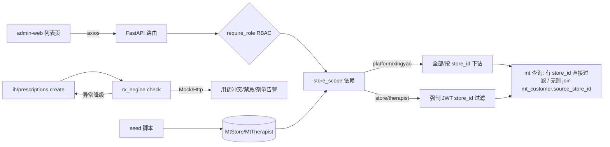

## 用户需求

P3 生产就绪阶段，覆盖全部可执行代码项 + 合规清单文档（等保三级/执业许可仅出文档，非代码）。经澄清确认：外部合理用药引擎走「抽象层 + Mock 实现」，预留真实对接点。

## 产品概述

在已完成 P0/P1/P2 的基础上，消除平台模块占位、补齐生产合规前置（行级数据隔离、种子数据、处方合理用药校验），并产出等保三级与执业许可合规清单。

## 核心功能

- **plat 模块真实化**：AI 模型目录（plat_ai_model）与数据资产目录（plat_data_asset）由占位接口升级为真实 CRUD（列表/详情/创建/更新/上线下线），带 RBAC（platform/xingyao）与审计落库；admin-web 新增两个列表页。
- **RLS 行级隔离**：store/therapist 角色仅能访问本门店数据。带 store_id 的表（treatment_record/store_metrics/customer）直接过滤；无 store_id 的 mt_* 表（repurchase_prediction/risk_profile/care_plan/pain_assessment/effect_tracking）经 mt_customer.source_store_id 关联过滤。JWT 扩展 store_id 声明。
- **种子数据**：MtStore / MtTherapist 幂等 seed 脚本（可重复执行），提供真实门店与调理师，绑定 store_id，供 RLS 与 dev 联调使用。
- **外部合理用药引擎**：provider 抽象层 + Mock 校验实现（用药冲突/禁忌/剂量告警），在处方开方前前置校验，失败降级不阻断主链路，预留真实 HTTP 供应商对接点。
- **合规清单文档**：依据技术架构 15.9 章，汇总等保三级测评项与互联网医院执业许可清单，产出 .md 与 .docx。

## 技术栈选型

- 后端：FastAPI + SQLAlchemy(Async) + Alembic + PyJWT（沿用现有栈，不引入新依赖）。
- 前端：React + TypeScript + Ant Design Pro + ProTable（沿用现有 admin-web 设计体系，保持一致性，不引入新组件库）。
- 验证：机制级 `verify_p3.py`（语法编译 + 路由注册数 + 纯函数 + 导入验证，不依赖 DB）；`npx tsc --noEmit`。

## 实现方案

### 总体策略

四项代码交付均复用既有模式（统一 `success()`/`PageResult`、`write_audit` 随事务、`require_role` RBAC、`pred_log` 独立事务降级），零新增架构模式，降低回归风险。

### 关键技术决策

1. **plat 真实化**：直接复用已建 ORM（`PlatAiModel`/`PlatDataAsset` 字段齐备），仅补 schema 与 CRUD 路由。列表接口带分页与 `sensitivity_level`/`status` 过滤；写操作统一 `write_audit(action, resource, after_json)`。避免重写模型。
2. **RLS 行级隔离**：在 `core/deps.py` 新增 `store_scope(payload, store_id: int|None = Query(None))` 依赖：

- `platform`/`xingyao`：返回 `store_id`（可为 None=全部，或按参数下钻）。
- `store`/`therapist`：从 JWT `store_id` 声明取（缺失则 403），查询参数被忽略（防越权）。
- 其余角色：403。
- 各 mt 列表接口注入 `scope` 并拼过滤：有 `store_id` 列直接 `where(col==scope)`；无 `store_id` 的表用 `where(customer_id.in_(select(id).where(source_store_id==scope)))`（customer_id/source_store_id 均已建索引，子查询规模可控）。该方案对现有接口签名改动最小，仅增加可选依赖。

3. **JWT 扩展 store_id**：`auth.dev-token` 与 `ih/users` 登录增加可选 `store_id` 声明写入；seed 后 dev-token 可用真实门店 id 签发，使 RLS 在 dev 可验证。生产由门店账号体系下发（P3 后续）。
4. **种子数据**：新增 `app/db/seed.py` + 命令行入口，按 `name`/`license_no` 幂等 upsert（先查后插/合并），不破坏既有数据；可经 `alembic` env 或 `python -m app.db.seed` 运行。
5. **合理用药引擎**：新增 `services/rx_engine/` 包 —— 抽象基类 `RxEngine`（方法 `check(prescription) -> RxResult`），`MockRxEngine`（基于内置规则/相互作用表返回 conflicts/contraindications/dosage_warnings），`HttpRxEngine`（骨架 + TODO 真实端点）。`ih/prescriptions.create` 调用 `check`，异常/超时降级为 `warnings=[]` 并记日志，不阻断开方。provider 通过 `settings` 或工厂选择，便于后续切换真实引擎。

### 性能与可靠性

- RLS 子查询过滤复用现有索引，避免全表扫描；列表均分页。
- 合理用药校验失败仅告警降级，保障主链路可用（参考 `pred_log` 独立事务模式）。
- seed 幂等，可重复执行无副作用。

## 实现注意事项

- RLS 改动须覆盖所有 mt 列表端点（customers/pain_assessment/care_plans/treatment_records/repurchase_predictions/risk_profiles/stores/therapists/store_metrics），用 [subagent:code-explorer] 先全量扫描端点与 store_id 关联点，避免遗漏导致越权。
- JWT store_id 声明仅 dev-token/登录可选写入，生产 `debug=False` 时 dev-token 404（既有约束不变）。
- 本环境无 PG/ClickHouse 运行时，逻辑与接线以纯函数 + 路由导入 + 语法编译验证；真实读写留 `alembic upgrade head` + 起服务运行时验证。verify 脚本末尾避免 GBK 不支持字符。

## 架构设计



## 目录结构

```
code/backend/
├── app/
│   ├── schemas/plat.py                 # [MODIFY] 新增 AiModel/DataAsset 的 create/update/out schema
│   ├── api/v1/plat/
│   │   ├── ai_models.py                # [MODIFY] 真实 CRUD（列表/详情/创建/更新/上线下线）+ RBAC + 审计
│   │   └── data_assets.py              # [MODIFY] 真实 CRUD + RBAC + 审计
│   ├── core/
│   │   ├── deps.py                     # [MODIFY] 新增 store_scope 依赖（RLS 核心）
│   │   └── security.py                 # [MODIFY] 令牌签发支持可选 store_id 声明
│   ├── api/v1/auth.py                  # [MODIFY] dev-token 接受 store_id 参数
│   ├── api/v1/ih/users.py              # [MODIFY] 登录可选写入 store_id 声明
│   ├── api/v1/ih/prescriptions.py      # [MODIFY] 开方前调用 rx_engine.check，降级不阻断
│   ├── api/v1/mt/                      # [MODIFY] 全部列表端点注入 store_scope 过滤（9 个路由文件）
│   ├── services/rx_engine/             # [NEW] 合理用药引擎包
│   │   ├── __init__.py                 # 工厂/导出
│   │   ├── base.py                     # RxEngine 抽象基类 + RxResult 类型
│   │   ├── mock.py                     # MockRxEngine 内置规则校验
│   │   └── http.py                     # HttpRxEngine 骨架（真实对接预留）
│   └── db/seed.py                      # [NEW] MtStore/MtTherapist 幂等 seed
├── verify_p3.py                        # [NEW] 机制级验证脚本
code/admin-web/
├── src/constants/api.ts                # [MODIFY] 增加 aiModels / dataAssets 端点
├── src/services/plat.ts                # [NEW] plat 服务（列表接口封装）
├── src/routes/plat/ai-models/index.tsx # [NEW] AI 模型目录列表页（ProTable）
├── src/routes/plat/data-assets/index.tsx # [NEW] 数据资产目录列表页（ProTable）
├── src/App.tsx                         # [MODIFY] 注册路由
└── src/layouts/BasicLayout.tsx         # [MODIFY] 菜单接入两个 plat 页面
合规清单与等保三级准备工作.md            # [NEW] 合规清单（md）
合规清单与等保三级准备工作.docx          # [NEW] 合规清单（docx，经 [skill:docx]）
```

## 关键代码结构

```python
# app/core/deps.py 新增
def store_scope(
    payload: dict = Depends(current_user),
    store_id: int | None = Query(default=None),
) -> int | None:
    """RLS 行级隔离作用域。platform/xingyao 可按参数下钻；store/therapist 强制取 JWT store_id。"""
    ...

# app/services/rx_engine/base.py
class RxResult(BaseModel):
    conflicts: list[dict]
    contraindications: list[dict]
    dosage_warnings: list[dict]

class RxEngine(ABC):
    @abstractmethod
    def check(self, prescription: dict) -> RxResult: ...
```

## 设计风格

沿用现有 admin-web 的 Ant Design Pro 企业级设计语言（与 customer/repurchase/risk 页面保持完全一致），不引入新组件库。两个新页面均为数据目录列表页，采用 ProTable + 筛选栏 + 标签色块呈现敏感等级与模型状态，强调信息密度与可读性。

## 页面规划（2 页）

### 1. AI 模型目录页（/plat/ai-models）

- 顶部筛选栏：模型名、版本、状态（offline/online）、算法类型。
- 列表块：ProTable 列含 名称/版本/算法类型/状态标签/指标(准确率等 JSON 摘要)/上线时间；状态用彩色 Tag（online=绿，offline=灰）。
- 操作块：行内「上线/下线」按钮（platform/xingyao 可见），触发状态变更并写入审计。

### 2. 数据资产目录页（/plat/data-assets）

- 顶部筛选栏：资产名、归属方、敏感等级 L1-L4。
- 列表块：ProTable 列含 名称/归属/敏感等级(色块 Tag: L1 蓝/L2 青/L3 橙/L4 红)/质量评分(进度条)/更新频率/血缘摘要。
- 详情块：展开行显示 lineage_json 血缘与用途范围。

两页共享 BasicLayout 顶/底导航与权限守卫，风格统一、响应式（桌面栅格自适应）。

## 推荐的 Agent 扩展

### SubAgent

- **code-explorer**
- 用途：在全量实现 RLS 前，扫描 `app/api/v1/mt/` 下所有列表端点与 store_id/customer_id 关联点，输出需注入 `store_scope` 的精确清单。
- 预期结果：无遗漏地定位 9 个 mt 路由文件中需加过滤的端点，避免越权数据泄露。

### Skill

- **docx**
- 用途：依据技术架构 15.9 章，将等保三级测评项与互联网医院执业许可清单生成为 `.docx`（与既有 .md 同步的文档产出约定一致）。
- 预期结果：产出 `合规清单与等保三级准备工作.docx`，格式含分级标题与表格清单，可直接交付合规排期。