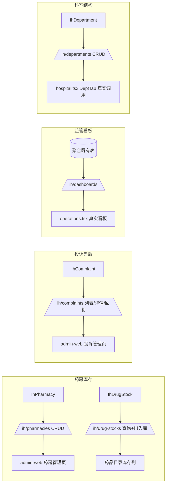

## 用户需求

提交已完成的前四项工作（f4925a0 已推送），并为"P3 双缺模块"生成建设方案。用户澄清：四个模块**全部建设**，按**业务闭环优先**排序。

## 产品概述

互联网医院后台当前有 4 个模块（科室结构、合作药房、投诉售后、监管看板）前端为硬编码演示态或零实现，后端 router/模型/迁移全部缺失。本次从后端建表+迁移+router+schema，到 admin-web 前端真实页面，打通这四条业务闭环，替换现有 `hospital.tsx` 的 `DEMO_*` 演示态与 `operations.tsx` 的临时聚合。

## 核心功能

- **药房库存（优先级1）**：新建 IhPharmacy（药房基础信息）+ IhDrugStock（药品库存，按药房×药品维度）；后端 `/ih/pharmacies` 全 CRUD、`/ih/drug-stocks` 库存查询与出入库调整；药品目录页补库存列与编辑入口。
- **投诉售后（优先级2）**：新建 IhComplaint（关联 order_id/user_id、类型、内容、状态、回复）；后端 `/ih/complaints` 列表/详情/处理回复；前端新建投诉管理页与菜单入口，敏感信息脱敏展示。
- **监管看板（优先级3）**：后端 `/ih/dashboards` 聚合端点（处方量、审方通过率、投诉量、低库存预警、药师审方明细），复用既有统计 query；`operations.tsx` 替换为真实接口。
- **科室结构（优先级4）**：新建 IhDepartment（名称/主任/备注）；后端 `/ih/departments` 全 CRUD；`hospital.tsx` 的 DeptTab 改为真实调用（doctor.dept 暂保留 String 命名，避免大改，后续外键化）。

## 技术栈选择

- 后端：Python 3.11 + FastAPI + SQLAlchemy 2.0（Async）+ Alembic（复用现有栈，最新 DB 版本 v0012）
- 前端：React + Ant Design Pro（admin-web，复用 ProTable/ModalForm/ProLayout 既有模式）
- 错误模型：统一 HTTP 200 + body.code≠0（复用 `success/AppError` 既有模式，不引入 4xx）
- RLS：应用层 `deps.store_scope` 注入 store_id/pharmacy_id 过滤（新增表保持一致）
- 等保三级：姓名/手机/身份证脱敏存储与展示一致；投诉含 PII 需脱敏列展示

## 实现方式

### 总体策略

分四个独立 Stage（药房库存→投诉售后→监管看板→科室结构），每个 Stage 统一走"model → migration → schema → router → service 封装 → 前端页面/改造"链路，复用现有 ih 模块的 router/schema/分页/RLS 模式，不引入新业务概念。

### 关键技术决策

1. **药房库存拆两表**：`IhPharmacy`（基础信息，类比 IhDrug 风格）与 `IhDrugStock`（drug_id+pharmacy_id 联合唯一，stock/safety_stock/updated_at）。理由：库存随药房/药品维度变化频繁，与药品目录解耦避免污染 IhDrug；IhPharmacist.pharmacy_id 与 IhDrug 均无 pharmacy 关联，需独立药房实体承接。
2. **投诉关联锚点**：IhComplaint.order_id 关联 IhOrder（已有 prescription_id/type），user_id 关联 IhUser（脱敏）。状态机：pending→processing→resolved/closed。
3. **监管看板聚合端点**：`/ih/dashboards` 用单个 GET 返回聚合 JSON（处方总数、审方通过率、投诉量、低库存药品列表、近 N 日趋势），后端直接聚合既有表（ih_prescription/ih_complaint/ih_drug_stock），替代前端 4×page_size=1 拼 total 的临时方案；趋势用 SQL `func.date_trunc` 或按日期分组，限制返回最近 30 天避免大查询。
4. **科室外键化取舍**：本次 IhDepartment 建表 + CRUD，doctor.dept 保留 String 命名（写科室名称冗余），不在本次改 IhDoctor 外键，避免波及医师审核/开方链路（爆炸半径控制）。
5. **性能**：库存/投诉列表均走 `PageResult` 分页 + 索引（drug_id/pharmacy_id/order_id/status）；监管看板聚合加 `@lru_cache` 或短 TTL 缓存避免每次重算；不引入 N+1（关联用 selectinload/joinedload）。

### 实现要点

- 迁移：新建 `0013_*` 系列迁移（含 pharmacy/drug_stock/complaint/department 建表 + 必要索引），幂等 exists 检查，可 `alembic upgrade head` 跑通。
- RLS：pharmacies/drug_stocks/complaints 按 store_id 或 pharmacy_id 注入过滤（deps 既有 store_scope）；platform/xingyao 角色可跨域。
- 爆炸半径：仅新增表与路由，不改既有 ih 7 模块逻辑；hospital.tsx/operations.tsx/drug-catalog 为原地改造，不重建其他页面。
- 敏感信息：投诉 user 字段、患者字段均走 `_mask` 脱敏列，前端不展示明文身份证/手机。

## 架构设计



## 目录结构

```
code/backend/app/models/ih_models.py          # [MODIFY] 新增 IhPharmacy / IhDrugStock / IhComplaint / IhDepartment 四个模型类
code/backend/app/schemas/ih.py                # [MODIFY] 新增 Pharmacy/ DrugStock/ Complaint/ Department 的 Create/Out schema
code/backend/app/api/v1/ih/                    # [NEW] pharmacies.py / drug_stocks.py / complaints.py / dashboards.py / departments.py 五个 router
code/backend/app/api/v1/ih/__init__.py        # [MODIFY] 注册五个新 router 到 ih 聚合
code/backend/migrations/versions/             # [NEW] 0013_xxxx_p3_modules.py 建表迁移（幂等）
code/admin-web/src/services/ih.ts             # [MODIFY] 补 pharmacies/drug-stocks/complaints/dashboards/departments 服务封装
code/admin-web/src/routes/ih/                  # [MODIFY] drug-catalog 补库存列；[NEW] complaints/index.tsx 投诉管理页
code/admin-web/src/routes/ih/hospital.tsx     # [MODIFY] DeptTab/PharmacyTab 改为真实 service 调用，删除 DEMO_* 硬编码
code/admin-web/src/routes/ih/operations.tsx   # [MODIFY] 替换为 /ih/dashboards 真实聚合
code/admin-web/src/layouts/BasicLayout.tsx    # [MODIFY] 补 /ih/complaints 菜单入口
code/mp-taro 无需改动（P3 为管理后台范畴）
```

## 关键代码结构（接口契约）

```python
# ih_models.py 新增四表核心字段
class IhPharmacy(Base, TimestampMixin):
    __tablename__ = "ih_pharmacy"
    name: Mapped[str]            # 药房名称
    region: Mapped[str | None]   # 区域
    license_no: Mapped[str | None]  # 药品经营许可证
    status: Mapped[str] = mapped_column(String(16), default="active")

class IhDrugStock(Base, TimestampMixin):
    __tablename__ = "ih_drug_stock"
    drug_id: Mapped[int]         # 关联 ih_drug.id
    pharmacy_id: Mapped[int]     # 关联 ih_pharmacy.id
    stock: Mapped[int] = mapped_column(Integer, default=0)
    safety_stock: Mapped[int] = mapped_column(Integer, default=0)

class IhComplaint(Base, TimestampMixin):
    __tablename__ = "ih_complaint"
    order_id: Mapped[int | None]
    user_id: Mapped[int | None]  # 脱敏展示
    type: Mapped[str]            # quality/service/refund
    content: Mapped[str]
    status: Mapped[str] = mapped_column(String(16), default="pending")
    reply: Mapped[str | None]

class IhDepartment(Base, TimestampMixin):
    __tablename__ = "ih_department"
    name: Mapped[str]
    head: Mapped[str | None]
    remark: Mapped[str | None]
```

## Agent Extensions

### SubAgent

- **code-explorer**
- Purpose: 在 Stage3 监管看板与 Stage1 库存改造前，深查 operations.tsx 现有临时聚合、drug-catalog 页面字段、deps.store_scope 注入方式，确保新增 router 的 RLS 与既有分页/错误模型模式一致
- Expected outcome: 产出各 Stage 可安全复用的既有 router/schema 代码片段与 RLS 注入点，避免重复造轮子与破坏既有链路