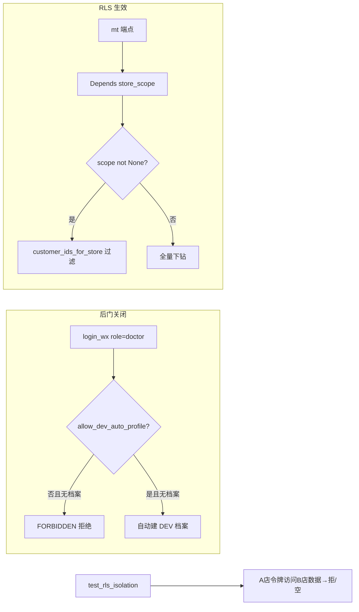

## 用户需求

用户基于上一轮《状态自检与后续任务报告》中提出的 P0 级对抗式硬伤，下达"开始修复"指令，明确指向 H1 与 H2 两个 P0 代码级安全硬伤的修复（H3 支付生产化、H4 合理用药真引擎依赖外部资质，不在本次范围）。

## 核心功能（修复内容）

- **H2：关闭 DEV 建档后门（合规红线）**：`app/api/v1/ih/users.py` 的 `_resolve_subject` 当前对任意 `role=doctor`/`pharmacist` 且无关联档案的用户，**无条件自动建 `DEV-DOC`/`DEV-PHA` 档案并签发医师/药师 JWT，不受任何环境守卫**。修复为：仅在显式开发开关下允许自动建档（保留 dev 便利），生产环境默认拒绝并返回明确业务错误（FORBIDDEN，提示"账号无执业/药师档案，请先完成资质认证"）。
- **H1：补 RLS 隔离缺口（行级隔离生效）**：
- `risk_profiles.py`：`predict_risk`/`list_risk_profiles` 均未注入 `store_scope`，任意门店角色可读写全量风险画像 → 补 `Depends(store_scope)` 并用 `customer_ids_for_store(scope)` 过滤。
- `effect_tracking.py`：`create`/`list` 已注入 `scope` 但函数体内从未使用（死参数）→ 补 `customer_ids_for_store(scope)` 过滤；补 import。
- `scheduling.py`：`_load_therapist` 手工误调 `store_scope(user, db)`（第二实参 `db` 被当作 scope_store_id 使用，参数语义错误）→ 重构为路由层 `Depends(store_scope)` 注入后正确传参，消除误 403 / 越权。
- **H1 配套：多租户越权集成测试**：现有 tests 无 RLS 越权断言（"注入≠生效"）。新增 `test_rls_isolation.py`，用两个门店令牌证明 A 门店无法读/写 B 门店数据（返回 FORBIDDEN 或空结果），固化隔离生效证据。

## 验收与边界

- 不破坏现有 41 个 pytest 用例；`alembic current` 仍为 head 0015（无表结构变更，不新增迁移）。
- 保留开发便利性：后门改为受环境开关守卫，默认关闭。
- 前端 `tsc --noEmit` 不受影响（本次纯后端）。
- 完成后按用户既往习惯 git commit + push 到 origin/main（列为最后一步）。

## 技术栈选择

- 后端：Python 3.11 + FastAPI + SQLAlchemy 2.0 Async + Alembic（复用现有栈，无新增依赖）
- 测试：pytest + httpx（ASGI transport，复用 test_mt_compliance.py / test_p6_endpoints.py 既定模式：DB 不可达自动 skip、种子高位固定 id、_db_available 探测 + engine.dispose）
- 配置：Pydantic Settings（config.py），新增 `allow_dev_auto_profile: bool`（默认 False）作为后门守卫，参照既有 `wxpay_dev_sandbox: bool = True` 开关风格
- 错误模型：统一 `ErrorCode.FORBIDDEN`（2003）/ `RESOURCE_NOT_FOUND`（3004，别名 NOT_FOUND）

## 实现方式

### 总体策略

聚焦两个 P0 硬伤的最小正确修复，复用现有 `store_scope`/`customer_ids_for_store` 模式（基准：`mt/pain_assessment.py:46-50`），不引入新概念、不新增迁移、不改表结构。后门以"环境开关守卫 + 生产拒绝"方式保留 dev 便利并消除合规风险。

### 关键技术决策与理由

1. **后门守卫用新增配置开关而非删除**：直接删除会导致 dev 联调无法登录医生端。新增 `allow_dev_auto_profile: bool = False`（config.py），`users.py` 仅在 `settings.allow_dev_auto_profile` 为真时自动建档；生产（默认 False）且无档案时抛 `FORBIDDEN`。理由：兼顾"等保三级禁止伪造医师身份"与"开发态登录便捷"双重诉求，且无需改动 JWT 签发链路。
2. **RLS 修复统一走 `Depends(store_scope)` 注入**：`risk_profiles.py` 两个端点补 `scope: int | None = Depends(store_scope)`；`effect_tracking.py` 已有注入，仅补过滤逻辑与 import。`scope is None`（platform/xingyao 下钻空）时不加门店过滤（维持可下钻语义）。理由：与 `pain_assessment.py` 完全一致，降低认知负担与回归风险。
3. **scheduling.py 重构 `_load_therapist` 参数**：将错误的 `store_scope(user, db)` 手工调用改为接收已注入的 `scope` 参数（`scope: int | None`），路由层用 `Depends(store_scope)` 注入后传入。8 处调用点同步补参。理由：消除"AsyncSession 被当 scope_store_id"的参数语义 bug，使平台角色下钻与门店角色强制隔离都正确。
4. **越权测试用双门店种子 + 双令牌断言**：种子两个门店（993010/993011）各自客户（993001/993002），分别签发 store 令牌（带 store_id claim），断言 A 店令牌访问 B 店客户数据被拒（FORBIDDEN 或返回空）。理由：把"注入≠生效"证伪为"注入=生效"，对齐对抗式审查要求。
5. **复用 `create_access_token` 扩展 store_id claim**：需确认 `create_access_token(subject, role, **extra)` 是否支持额外 claim；若不支持则扩展签名以接收 `store_id`。理由：store 角色 RLS 依赖 JWT `store_id` 声明（deps.STORE_CLAIM），测试必须能签发带该声明的令牌。

### 实现要点（防回归）

- 仅在 `scope is not None` 时 append `customer_ids_for_store(scope)`；不破坏 platform/xingyao 全量下钻。
- `risk_profiles.predict_risk` 写库前校验 `body.customer_id` 隶属本店（scope 非 None 时），避免跨店写入。
- `scheduling.py` 的 `scope` 参数透传至 `_load_therapist`，保留原"th.store_id != scope → FORBIDDEN"语义。
- 顺带清理 `repurchase_predictions.py:70-75` 的 `customer_id` 条件重复 append（小瑕疵，低风险）。
- 不改动既有测试断言与种子 id 区间，避免牵连 41 用例。

## 架构设计



## 目录结构

```
code/backend/app/core/config.py              # [MODIFY] 新增 allow_dev_auto_profile: bool = False 守卫开关
code/backend/app/api/v1/ih/users.py          # [MODIFY] _resolve_subject：后门受开关守卫，否则 FORBIDDEN
code/backend/app/api/v1/mt/risk_profiles.py  # [MODIFY] 两端点注入 store_scope 并用 customer_ids_for_store 过滤（写校验+读过滤）
code/backend/app/api/v1/mt/effect_tracking.py# [MODIFY] 复用已注入 scope，补 customer_ids_for_store 过滤；补 import
code/backend/app/api/v1/mt/scheduling.py     # [MODIFY] _load_therapist 改收 scope 参数，8 处调用补 Depends(store_scope) 注入
code/backend/app/api/v1/mt/repurchase_predictions.py # [MODIFY] 清理 customer_id 重复 append（顺带）
code/backend/tests/test_rls_isolation.py     # [NEW] 多租户越权集成测试（双门店种子+双令牌断言）
code/backend/app/core/security.py            # [MODIFY 若需] 扩展 create_access_token 支持 store_id claim（供测试签发）
```

## 关键代码结构（接口契约）

```python
# config.py 新增
allow_dev_auto_profile: bool = False  # 仅 dev 开启：允许微信登录自动建档医师/药师；生产默认 False（合规红线）

# users.py _resolve_subject 关键分支（伪代码）
if doc is None:
    if not settings.allow_dev_auto_profile:
        raise BusinessError(ErrorCode.FORBIDDEN, "账号无执业医师档案，请先完成资质认证")
    doc = IhDoctor(user_id=user.id, license_no=f"DEV-DOC-{user.id}", status="pending")
    db.add(doc); await db.flush()

# risk_profiles.py list 过滤（与 pain_assessment 对齐）
scope: int | None = Depends(store_scope)
if scope is not None:
    conds.append(MtRiskProfile.customer_id.in_(customer_ids_for_store(scope)))
```

## Agent Extensions

### SubAgent

- **code-explorer**
- Purpose: 在写代码前精查 `create_access_token` 是否支持 `store_id` 额外 claim（security.py），以及 `MtRiskProfile`/`MtEffectTracking` 表是否含 `customer_id` 列、现有 mt 种子是否可复用，避免凭推断写错字段名导致回归。
- Expected outcome: 产出 `create_access_token` 签名与 claim 注入方式、两表关键列、可复用种子片段，作为后续编码的精确依据。