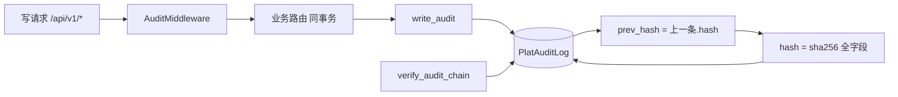

## 用户需求

一次性完成三项任务：①把 mp-taro 小程序的空壳页补齐为可用的 2C 患者端，对齐已建后端 `/ih` 接口；②P4 安全真落地，即双因子认证（TOTP）的真校验与审计日志哈希链防篡改；③在既有合规清单基础上，起草一份可直接交付的等保三级测评与互联网医院执业许可材料清单（含模板、责任方、产出物）。

## 产品概述

- 小程序端：从仅有占位文本的空壳，升级为可走通"首页 → 复诊开方 → 订单支付 → 我的/健康档案"闭环的 2C 患者小程序。
- 后端安全：让双因子从"占位拦截"变为"可签发/启用/验证"的真实能力，让审计日志从"普通落库"变为"逐条哈希、前后链式、可校验防篡改"。
- 合规产物：把等保三级与执业许可的测评项转化为可提交的证据材料清单。

## 核心功能

- 小程序：首页服务入口 + 复诊确认弹窗；订单列表/详情/去开药（凭处方建单）；我的（个人中心/退出）；健康档案（聚合问诊/处方/评估）；处方详情。
- 双因子：TOTP 密钥签发与二维码 URI、启用校验、登录时真校验验证码。
- 审计哈希链：写操作全量审计、逐条计算 hash 并链式挂接 prev_hash、提供链完整性校验。
- 合规清单：等保三级 10 个控制类证据清单 + 执业许可材料清单（模板/责任方/状态）。

## 技术栈

- 小程序：Taro 3.6.23 + React 18 + TypeScript（现有约定：原生 `@tarojs/components` + 内联样式，不引入 UI 库）
- 后端：FastAPI + SQLAlchemy 2.0(async) + PostgreSQL + Alembic；安全优先标准库（hmac/time/struct/hashlib），零新增依赖
- 文档：Markdown 编写，pandoc 生成 .docx（与既有文档产出 convention 一致）

## 实现方案

### ① mp-taro 小程序空壳页补齐

对齐后端既有 `/ih/orders`、`/ih/prescriptions`、`/ih/consultations` 端点（字段以 `ih.py`/`ih_models.py` 实际 Out 为准）。采用既有 `services/ih.ts` 封装风格扩展订单/处方详情/健康档案聚合接口；页面沿用原生组件 + 内联样式，不引入新依赖。首页增加复诊确认 `Modal`；订单页实现列表→详情→"申请开药"（POST 订单，body 含 prescription_id）；新增 `profile` 与 `health-record` 页面并在 `app.config.ts` 注册。

### ② P4 双因子真落地（TOTP / RFC 6238）

用标准库实现 TOTP（无 pyotp 依赖）：密钥 32B 随机（`base64` 存储），`verify_totp(secret, code, window=1)` 用 `hmac.new(secret, time//30, sha1)` 比对；启用流程 `setup-2fa`（返回 provisioning URI/otpauth 供 authenticator 扫码）→ `enable-2fa`（校验一次性 code 后写 `totp_secret` 并置 `two_factor_enabled=True`）；`/auth/login` 在 `two_factor_enabled` 时对 `body.code` 做真校验。密钥落库为高风险字段，先明文存储并标注"待落库加密/信封加密"（与既有 `password_hash` 一致，后续统一加密）。

### ③ P4 审计日志哈希链防篡改

`PlatAuditLog` 新增 `seq_no:int`、`prev_hash:str`、`hash:str` 三列；`write_audit` 在事务内查询最近一条记录的 `hash` 作为 `prev_hash`，`seq_no` 取 `count+1`，`hash = sha256(seq_no|prev_hash|actor_id|action|resource|before_json|after_json|created_at)`；`AuditMiddleware` 由占位 `pass` 改为：解析 JWT 取 `actor_id/role`，对写方法写 `plat_audit_log`（与业务同事务）。提供 `verify_audit_chain` 脚本/接口遍历校验 `hash` 与 `prev_hash` 一致性，供等保"防篡改"证据。性能：哈希 O(1)，仅多一次 `id desc limit 1` 索引查询。

## 实现要点

- 向后兼容：不破坏 `dev-token` 调试态；`two_factor_enabled=False` 时登录行为不变。
- 迁移：新增 Alembic 修订（`0007_2fa_secret`、`0008_audit_hash_chain`），与现有 `0006_plat_account` 衔接。
- 演示校验：seed 脚本为演示账号开通 TOTP 并打印 otpauth URI，便于真跑登录链路。
- 日志：沿用 `app.core.response.success`；审计不记录敏感明文，仅存前后 JSON 摘要。

## 架构设计



## 目录结构与文件

### 新增/修改（前端 mp-taro）

- `code/mp-taro/src/services/ih.ts` [MODIFY] 新增 `listOrders/getOrder/createOrder/getPrescription/getHealthProfile` 封装，沿用既有 request/API 约定。
- `code/mp-taro/src/app.config.ts` [MODIFY] 注册 `profile`、`health-record` 页面。
- `code/mp-taro/src/pages/index/index.tsx` [MODIFY] 首页服务卡片 + 复诊确认弹窗 + 入口。
- `code/mp-taro/src/pages/order/index.tsx` [MODIFY] 订单列表 + 详情 + 去开药流程（替代占位文本）。
- `code/mp-taro/src/pages/prescription/index.tsx` [MODIFY] 增加处方详情展示。
- `code/mp-taro/src/pages/profile/index.tsx` [NEW] 个人中心（用户信息/退出登录）。
- `code/mp-taro/src/pages/health-record/index.tsx` [NEW] 健康档案（聚合问诊/处方/评估）。

### 新增/修改（后端 P4）

- `code/backend/app/core/security.py` [MODIFY] 新增 TOTP：`gen_totp_secret()`、`totp_provisioning_uri(secret,account)`、`verify_totp(secret,code,window=1)`、`sha256_chain(...)`。
- `code/backend/app/models/plat_models.py` [MODIFY] `PlatAccount` 加 `totp_secret`；`PlatAuditLog` 加 `seq_no/prev_hash/hash`。
- `code/backend/app/api/v1/auth.py` [MODIFY] 登录真校验 code；新增 `setup-2fa`/`enable-2fa` 端点。
- `code/backend/app/services/audit.py` [MODIFY] `write_audit` 计算链式 hash。
- `code/backend/app/middleware/audit.py` [MODIFY] 真正实现写操作审计落库。
- `code/backend/app/schemas/plat.py` [MODIFY] `AuditLogOut` 暴露 `seq_no/prev_hash/hash`。
- `code/backend/alembic/versions/0007_2fa_secret.py` [NEW] 迁移。
- `code/backend/alembic/versions/0008_audit_hash_chain.py` [NEW] 迁移。
- `code/backend/app/db/seed.py` [MODIFY] 演示账号开通 TOTP 并打印 URI。
- `code/backend/verify_audit_chain.py` [NEW] 链完整性校验脚本。

### 新增（合规文档）

- `code/../等保三级与执业许可材料清单.md` [NEW] 证据/材料清单（模板、责任方、产出物、状态）。
- 同步生成 `.docx`（pandoc）。

## 关键代码结构（接口级）

```python
# app/core/security.py
def gen_totp_secret() -> str: ...
def totp_provisioning_uri(secret: str, account: str, issuer: str = "互联网医疗中心") -> str: ...
def verify_totp(secret: str, code: str, window: int = 1) -> bool: ...

# app/models/plat_models.py (PlatAuditLog 增量)
seq_no: Mapped[int]
prev_hash: Mapped[str]
hash: Mapped[str]
```

## 设计风格

采用医疗健康类 App 常见的"洁净 Apple HIG + 轻量卡片"风格：以医疗蓝/青为主色，白底大圆角卡片，克制的阴影与分割线，复诊确认等强提示用橙色强调。全部使用 Taro 原生组件与内联样式（延续既有工程约定，不引入 UI 库），保证微信小程序端轻量与一致。

## 页面规划（5 屏）

1. 首页 index：顶部品牌区 + 复诊确认弹窗 + 服务入口卡片（在线复诊/我的处方/去开药/健康档案）+ 底部 Tab。
2. 订单 order：订单状态筛选 Tab + 订单卡片列表（状态色标）+ 点击进入详情 + "申请开药"凭处方建单。
3. 订单详情/去开药：药品清单 + 处方药提示 + 收货信息 + 提交（Idempotency-Key 幂等）。
4. 我的 profile：用户脱敏信息卡 + 我的订单/处方/健康档案入口 + 退出登录。
5. 健康档案 health-record：问诊记录、处方记录、疼痛评估分期聚合卡片。