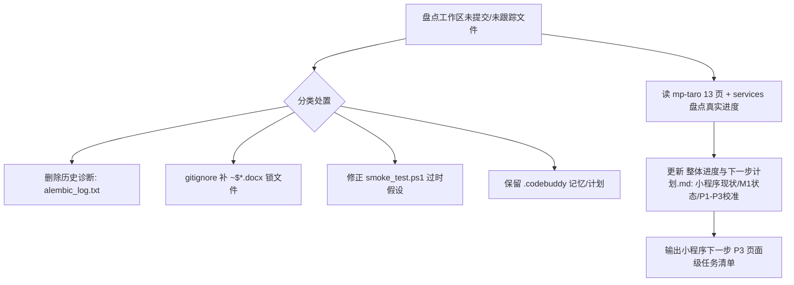

## 用户需求

用户要求"一并整理，并查看接下来的开发工作任务安排，小程序前端开发现在进行到哪一步，下一步怎么安排，一并处理"。拆解为三件一并处理的事项：

1. **工作区整理**：清理/归档当前未提交与未跟踪的散落文件，使仓库状态干净、可追踪。
2. **开发任务安排盘点**：基于项目既有计划文档（整体进度与下一步计划.md）与 M1 联调实际完成情况，梳理后续开发里程碑与优先级。
3. **小程序前端进度盘点与下一步**：基于实际代码树（13 个页面）而非过时文档，盘点小程序当前真实进度，并给出下一步开发安排。

## 产品概述

本次不是新功能开发，而是"收尾整理 + 状态对齐 + 路线明确"的综合性工程治理任务。目标是：把 M1 联调后的零散文件归位、用真实进度更新计划文档、明确小程序下一步迭代内容，使团队对"做到哪、下一步做什么"有一致认知。

## 核心特性

- 清理临时诊断文件（alembic_log.txt 为修复前失败日志、~$ 锁文件），避免误导与入库污染。
- 修正或归并 smoke_test.ps1（其 R4 验证假设 HTTP 422 与实测业务码 1001 不符，且处方 id 取值不严谨），使其成为可信的回归冒烟脚本。
- 盘点小程序 13 个页面真实完成度，区分"已接真实接口"与"展示壳"，输出进度矩阵。
- 更新《整体进度与下一步计划.md》，纳入"小程序已 13 页、M1 联调已完成（ae30db9）"等新事实，校准 P1/P3 状态。
- 基于既有 P0–P5 优先级，给出小程序下一步（P3 业务前台补位）的具体页面级任务清单。

## 技术栈选型

- 文档：Markdown（按用户约定默认仅 .md，不主动生成 .docx）。
- 小程序：Taro(React) + TypeScript（现有栈，code/mp-taro）。
- 后端：FastAPI（已 M1 联调验证，无需改动）。
- 脚本：PowerShell（现有 smoke_test.ps1 同栈）。

## 实现方法

采用"先盘点现状 → 再清理归位 → 后文档对齐 → 出路线"的顺序，避免在不了解真实进度时乱改文档。

### 关键技术决策

1. **以代码树为事实源盘点小程序进度**：直接读取 code/mp-taro/src/pages 下 13 个页面与 services/ih.ts，而非依赖 2026-07-26 计划文档中"5 空壳页"的旧结论（已过时）。理由：前序联调确认实际已有 13 页且部分接真实接口，文档必须校准。
2. **临时文件分类处置**：

- `alembic_log.txt`：修复前的失败日志（KeyError 链断裂），属历史诊断，不入库、直接删除。
- `~$...docx`：Office 临时锁文件，应加入 .gitignore 而非提交。
- `smoke_test.ps1`：修正其两处过时假设（R4 无处方应验业务码 1001 而非 HTTP 422；带处方下单应关联一个真实有效处方 id，可先用已 approved 的 id=1 并加注释说明凭方语义），使其成为可复现回归脚本后保留。
- `.codebuddy/memory/2026-08-01.md` 与 `.codebuddy/plans/*`：属代理工作记忆/历史计划，保留不删（计划文档是过程资产）。

3. **计划文档增量更新**：仅更新《整体进度与下一步计划.md》中"小程序现状""M1 状态""P1/P3 进度"三处，不重写全文，控制改动面。
4. **小程序下一步按 P3 业务前台补位拆解到页面级**：依据 PRD V2.0 与现有 13 页骨架，列出待补齐真实业务流的页面（doctor-chat 问诊消息流、order 支付跳转、prescription 列表与详情绑定、health-record 数据拉取、doctor-rx-create 与后端开方闭环核验）。

### 性能与可靠性

- 清理与文档更新均为低频、幂等操作，无性能风险。
- smoke_test.ps1 修正后应具备可重跑性（用 dev-token 动态取 id，避免硬编码导致环境差异失败）。
- 不改动任何后端/前端业务代码，仅整理与文档对齐，blast radius 极小。

## 实现注意（防回归）

- **勿误删代理记忆**：`.codebuddy/memory`、`plans` 是过程资产，仅整理不删；本次新增的 2026-08-01.md 必须保留。
- **文档约定**：默认只改 .md；不生成 .docx（用户 2026-07-26 约定）。
- **smoke_test 修正须与实测一致**：R4 无处方→业务码 1001；带处方→code 0 且回显 prescription_id；避免再出现 422 假设。
- **.gitignore 补全**：把 `~$*.docx` 锁文件模式加入，防止再次误跟踪。
- **范围控制**：本次不改业务代码、不起服务、不跑迁移；仅整理+文档+盘点。

## 架构设计

本次为工程治理任务，不引入新架构。变动仅涉及：工作区文件归位、.gitignore 规则补充、计划文档增量更新、smoke_test.ps1 逻辑修正。数据流不涉及。



## 目录结构与改动点

```
c:/Users/Lenovo/Desktop/互联网医疗中心平台/
├── .gitignore                    # [MODIFY] 补充 ~$*.docx Office 锁文件忽略规则
├── code/backend/alembic_log.txt  # [DELETE] 修复前失败日志，属历史诊断，不入库
├── code/infra/scripts/smoke_test.ps1  # [MODIFY] 修正 R4 验证假设(业务码1001非422)、处方id取值加注释，使其成为可信回归脚本
├── 互联网医疗中心平台整体进度与下一步计划.md  # [MODIFY] 增量更新：小程序13页现状、M1联调已完成(ae30db9)、P1/P3状态校准
└── .codebuddy/
    ├── memory/2026-08-01.md      # [KEEP] 今日联调记忆，保留
    └── plans/*                   # [KEEP] 历史计划归档，保留不删
```

## 关键验证清单

- 整理后 `git status` 不再出现 alembic_log.txt 与 ~$ 锁文件（或被 gitignore 覆盖）。
- smoke_test.ps1 逻辑与 M1 实测一致（R4 无处方→1001；带处方→0+回显）。
- 计划文档更新后包含"小程序 13 页、M1 已完成 ae30db9、P1 运行时验证核心完成"等新事实。
- 小程序进度矩阵清晰区分"已接真实接口 / 展示壳"，下一步 P3 页面级任务明确。

## Agent Extensions

### SubAgent

- **code-explorer**
- Purpose: 跨目录精准盘点 mp-taro 13 个页面真实完成度与 services/ih.ts 接口对接情况，避免依赖过时文档结论
- Expected outcome: 返回每个页面的"是否接真实接口/接了哪些接口/仍是展示壳"的准确清单，支撑计划文档校准与下一步任务拆解