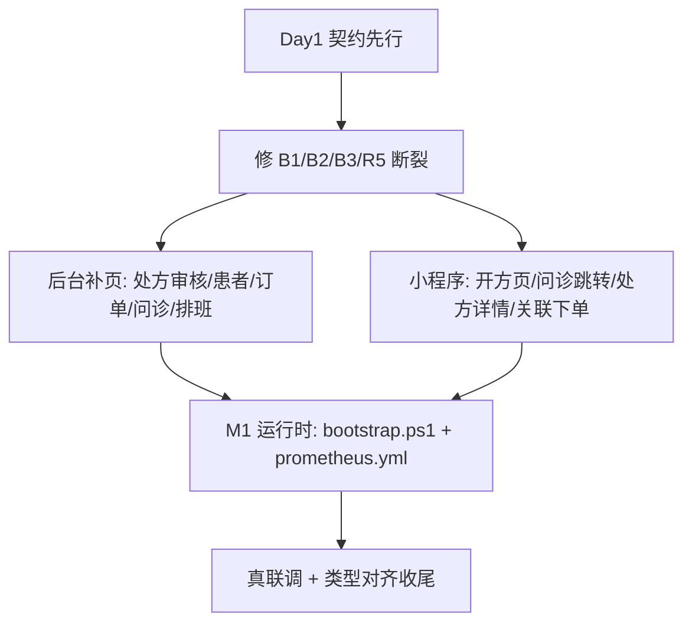

## 用户需求

用户要求按此前确定的优先级"立即开始实现"：在合规资质已就绪、微信支付（商户号待开）与第三方供应商（下周确认）暂未就绪的约束下，推进前端/后台开发与运行时联调就绪。

## 产品概述

本次为"内部闭环开发 + 联调就绪"冲刺，不强求对外运营态。目标：修复前后端契约断裂、补齐后端端点已具备但前台缺失的高价值页面、打通小程序"问诊→开方→审核→下单"主链路、并让运行时环境可一键起、可真联调。

## 核心特性

- 修复契约断裂（B1/B2/B3/R5）：医师审核端点、合规提交路径、处方状态枚举、审核人取当前用户，消除 404 死按钮与空列表。
- 后台补齐页面：处方审核工作台完整化、患者管理、订单管理、问诊会话监管、医生排班管理；plat 侧模型上下线与数据资产 CRUD。
- 小程序打通：医生开方页、问诊→开方跳转、处方独立详情、订单关联处方下单（处方药凭方购买合规）。
- 运行时 M1：一键 bootstrap 脚本、Prometheus 配置、requirements 明确化、敏感 .env 移出版本库。
- 契约防护：导出 openapi.json 作为前端唯一依据；mock 支付按微信 JSAPI 真实字段形状设计，预留 pay_engine 抽象钩子。

## 技术栈选型

- 前端：React + Ant Design Pro（admin-web）、Taro 3 + React + TS（mp-taro），均与现有代码一致。
- 后端：Python FastAPI（仅做契约对齐小修，不引入新框架）。
- 类型生成：从 `http://localhost:8000/openapi.json` 导出契约，生成/对齐 TS 类型（沿用现有 `services/*.ts` 手写模式，不引新工具链）。
- 运行时：Docker Compose（infra 已有编排）+ 一键 `.ps1` 引导脚本。

## 实现方法

采用"契约先行 → 修断裂 → 补页面 → 通主链路 → 起环境"的顺序，避免继续累积契约漂移。

### 关键技术决策

1. **契约先行（Day1 前置）**：先用 `curl localhost:8000/openapi.json` 核对后端真实端点，修正前端 service 与枚举，作为后续所有页面的唯一事实来源。理由：探索已发现 B1/B2/B3 三处断裂，继续盲写只会更糟。
2. **小修后端仅做契约对齐**：补 `POST /ih/doctors/{id}/approve|reject`、合规 `/submit` 已在（仅前端改路径），处方状态统一为 `pending_audit`。R6 药师角色属 RBAC 较大改动，列为"建议同步后端排期"，本次不强制。
3. **mock 支付按真实形状**：`orders.py /pay` 返回体设计为微信 JSAPI 五参数形状（`timeStamp/nonceStr/package/signType/paySign`），前端按此写，商户号到位只换 provider 不换前端。
4. **处方药下单关联处方**：`mp-taro order` 从已审核处方发起，`createOrder` 必传 `prescription_id`，满足合规。

### 性能与可靠性

- 页面级增量渲染，列表走现有 ProTable；不引入额外状态库。
- 运行时脚本幂等（migrate/seed 可重复执行）；bootstrap 失败有明确退出码与日志。
- 不触碰 node_modules、不引入新依赖，控制改动面。

## 实现注意（防回归）

- **勿整文件覆盖**：写 `services/ih.ts` 等新文件前必 `read_file` 确认是否已有（此前曾误覆盖导致 TS2305）。
- **枚举单一来源**：抽 `constants/enums.ts` 对齐后端状态，避免 `pending`/`pending_audit` 多处硬编码。
- **审计链正确**：审核操作 `reviewer_id` 取当前 JWT 用户，不写死 1。
- **敏感信息**：`backend/.env` 移出版本库并加入 `.gitignore`，避免等保审查失分。
- **范围控制**：不实现支付/供应商真实接入（等下周），不在本周铺 R6 药师 RBAC 大改。

## 架构设计

沿用现有分层：前端 `routes/*` + `services/*` + `constants/api.ts`；后端 `app/api/v1/{ih,mt,plat}`。本次仅在既有骨架上修契约、补页面、补脚本，不引入新架构模式。



## 目录结构

```
code/admin-web/src/
├── routes/ih/patients/index.tsx        # [NEW] 患者管理页, GET /ih/users
├── routes/ih/orders/index.tsx          # [NEW] 订单管理页, GET /ih/orders + pay
├── routes/ih/consultations/index.tsx   # [NEW] 问诊会话监管页
├── routes/ih/schedules/index.tsx       # [NEW] 医生排班管理页
├── routes/ih/rx-review/index.tsx       # [NEW] 处方审核工作台(详情抽屉+rx_check_json)
├── routes/ih/operations.tsx            # [MODIFY] 状态枚举 pending→pending_audit
├── routes/ih/hospital.tsx              # [MODIFY] 标记 DEMO, 不接假数据
├── routes/plat/ai-models/index.tsx     # [MODIFY] 补上下线/删除
├── routes/plat/data-assets/index.tsx   # [MODIFY] 补 CRUD
├── services/ih.ts                      # [MODIFY] 修 approve/reject 路径+新增常量
├── services/plat.ts                    # [MODIFY] 修 compliance 路径
├── constants/api.ts                    # [MODIFY] 补 ihUsers 等常量
└── constants/enums.ts                  # [NEW] 状态枚举单一来源

code/mp-taro/src/
├── pages/doctor-rx-create/index.tsx    # [NEW] 医生开方页
├── pages/prescription-detail/index.tsx # [NEW] 处方独立详情
├── pages/doctor-consult/index.tsx      # [MODIFY] 结束问诊→开方入口
├── pages/order/index.tsx               # [MODIFY] 关联 prescription_id 下单
├── app.config.ts                       # [MODIFY] 注册新路由
└── services/ih.ts                      # [MODIFY] 确认 createPrescription 调用

code/backend/app/api/v1/ih/doctors.py   # [MODIFY] 补 approve/reject 端点(B1)
code/backend/app/api/v1/ih/prescriptions.py # [MODIFY] 枚举/审核人取JWT(R5)
code/backend/app/api/v1/ih/orders.py    # [MODIFY] /pay 返回微信JSAPI形状(R3)

code/infra/
├── scripts/bootstrap.ps1               # [NEW] 一键起环境+迁移+种子
├── docker/prometheus/prometheus.yml    # [NEW] 采集配置(G2)
└── docker-compose.yml                  # [MODIFY] 挂 prometheus.yml
```

## Agent Extensions

### SubAgent

- **code-explorer**
- Purpose: 在实现各步骤前精确核对目标文件真实内容与后端端点，避免误覆盖与契约漂移
- Expected outcome: 每次修改前返回准确的现有代码结构与端点签名，保障改动精准、零回归