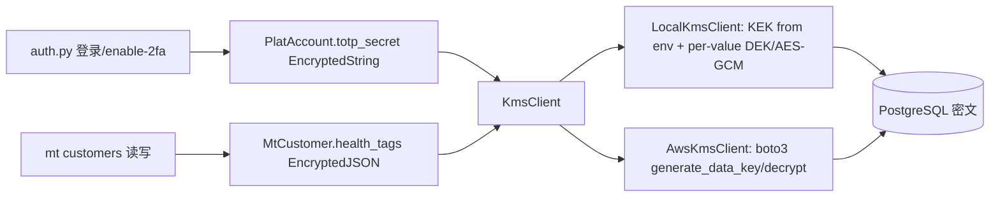

## 用户需求

落库加密（字段级信封加密），覆盖两类高风险数据：

- **plat_account.totp_secret**：当前明文存储（plat_models.py:87 注释明确"生产须信封加密/KMS 托管"），是双因子 TOTP 密钥，泄露等同于绕过双因子。
- **mt_customer.health_tags**：健康档案核心 JSON 字段（mt_models.py:20），含客户健康标签等敏感信息。

要求以"KMS"方式落地 totp_secret 加密；健康档案字段做字段级加密。P5 性能容灾不在本计划范围，留待后续。

## 核心功能

- 透明字段级加密：ORM 读写自动加解密，认证链路（auth.py 登录校验/enable-2fa 落库/seed 预置）与 schema 零改动。
- KMS 信封加密抽象：默认本地 KMS（主密钥经环境变量注入，每值随机数据密钥 AES-256-GCM，DEK 由 KEK 包裹）；预留 AWS KMS 适配器作为生产真实路径，切换配置即可启用。
- 数据迁移幂等：既有明文 totp_secret 与 JSON 健康档案重加密，health_tags 列类型 JSON→Text；已加密行自动跳过，可重复执行。
- 运行时验证：加密往返、错误密钥解密失败（完整性）、ORM 落库后 DB 为密文而读取为明文、2FA 登录链路仍跑通。

## 技术栈

- 语言/框架：Python 3.11 + FastAPI + SQLAlchemy 2.0（Async） + Alembic（既有栈，沿用）
- 加密库：新增 `cryptography>=42`（首个外部加密依赖，标准库无 AES；提供 AES-256-GCM 认证加密）；`boto3>=1.34` 仅作 AWS KMS 适配器可选依赖（extras，默认不装）
- 复用：既有 `app.core.security`（TOTP）、`app.core.config`（Settings/环境变量注入）、`app.models` TypeDecorator 模式

## 实现方式

### 1. KMS 抽象层 — 新建 `code/backend/app/core/kms.py`

- 定义 `KmsClient` 接口：`encrypt(plaintext: bytes) -> str` / `decrypt(token: str) -> bytes`。token 为 base64(JSON{ v, kek_nonce, wdek, dek_nonce, ct })。
- `LocalKmsClient`（默认，settings.kms_provider=="local"）：
- KEK 来自 `settings.kms_master_key`（环境变量 `KMS_MASTER_KEY` 注入，32 字节 hex/base64；dev 默认值仅本地，生产必须注入）。
- 信封加密：每值 `os.urandom(32)` 生成 DEK；AES-256-GCM(DEK) 加密明文（随机 nonce）；AES-256-GCM(KEK) 包裹 DEK（wrapped_dek + kek_nonce）。完整性由 GCM tag 保证，密钥错误即解密失败。
- 解密逆向：解包 → KEK 解裹 DEK → DEK 解密明文。
- `AwsKmsClient`（可选适配器，懒导入 boto3）：用 `generate_data_key`/`decrypt` 实现同接口，作为生产真实 KMS 路径；默认不启用。
- `get_kms()` 单例按配置返回。

### 2. 透明字段加密类型 — 新建 `code/backend/app/core/encrypted_field.py`

- `EncryptedString(TypeDecorator)`：底层 String/Text；`process_bind_param` 调 `kms.encrypt`；`process_result_value` 调 `kms.decrypt` 并 utf-8 解码。空值直通。
- `EncryptedJSON(TypeDecorator)`：底层 Text；绑定 `json.dumps` 后加密，结果 `json.loads` 后解密，用于 `health_tags`。
- 所有调用点（auth.py/seed.py/schemas）无需改动，ORM 读写自动加解密。

### 3. 模型改造

- `plat_models.py:87`：`totp_secret` 改用 `EncryptedString`（列名不变，DB 类型仍 String/Text，无需 DDL 改列，仅数据重加密）。
- `mt_models.py:20`：`health_tags` 改用 `EncryptedJSON`（DB JSON→Text，需迁移改列+重加密；无 DB 级 JSON 查询，安全）。

### 4. 配置与依赖

- `config.py` 增 `kms_provider: str = "local"`、`kms_master_key: str = "<32字节 dev 默认 hex>"`，注释强调生产经 `KMS_MASTER_KEY` 环境变量注入、禁止硬编码（沿用 config.py 顶部"禁止硬编码"约定，第14.5章）。
- `pyproject.toml` 新增 `cryptography>=42`；可选 `boto3>=1.34` 标注为 KMS 生产 extras。

### 5. Alembic 数据迁移 — 新建 `code/backend/alembic/versions/0008_encrypt_secret_and_health_tags.py`

- 幂等：用原始连接 `SELECT id, totp_secret`，值为空或非密文(token 格式)者经 `kms.encrypt` 后 `UPDATE`；已密文跳过。
- `health_tags`：先 `op.alter_column` 将 JSON 改 Text，再同样重加密既有行；幂等。
- 迁移前请备份 DB；解密用同一 KMS 可逆。

### 6. 验证（运行时）

- 新建 `code/backend/tests/test_field_encryption.py`：
- 单测：EncryptedString/EncryptedJSON 往返一致；LocalKmsClient 加解密一致；错误 KEK 解密抛异常（完整性）。
- 集成：创建 PlatAccount（ORM），用原始连接确认 DB 中 totp_secret 为密文，而 `acc.totp_secret` 读回为明文；enable-2fa 落库后仍可被 `verify_totp` 校验（登录链路跑通）。
- 跑 `pytest tests/test_field_encryption.py` 通过；可选冒烟确认 2FA 登录无误。

## 实现要点

- 性能：GCM 为对称加密，单值开销可忽略；每值独立 DEK 避免 KEK 高频使用，利于未来切云 KMS 按值托管。
- 一致性：严格复用既有"环境变量注入密钥 + 注释标注生产须接外部"风格，与 P4 安全增强一致。
- 爆炸半径控制：仅改加密相关模型列类型与新增模块，认证/schema 调用点零改动；迁移幂等可重复执行，不破坏既有数据。
- 安全：明文仅在内存短暂出现，落库全为密文；主密钥不落库、不硬编码。

## 架构设计

页面/调用点 → ORM 模型（TypeDecorator 透明加解密）→ KMS 抽象（本地/AWS）→ 数据库（密文）。



## 目录结构

```
code/backend/
├── app/core/
│   ├── kms.py                 # [NEW] KMS 抽象：LocalKmsClient(信封加密) + AwsKmsClient(可选) + get_kms()
│   ├── encrypted_field.py     # [NEW] EncryptedString / EncryptedJSON（TypeDecorator，透明加解密）
│   ├── config.py              # [MODIFY] 增 kms_provider / kms_master_key 配置项
│   └── security.py            # [不改] TOTP 逻辑不变，仅 totp_secret 经模型层透明加解密
├── app/models/
│   ├── plat_models.py         # [MODIFY] PlatAccount.totp_secret 改用 EncryptedString（列名不变）
│   └── mt_models.py           # [MODIFY] MtCustomer.health_tags 改用 EncryptedJSON（JSON→Text）
├── app/api/v1/auth.py         # [不改] 调用点零改动（acc.totp_secret 透明加解密）
├── app/db/seed.py             # [不改] acc.totp_secret 赋值透明加密
├── alembic/versions/
│   └── 0008_encrypt_secret_and_health_tags.py  # [NEW] 幂等数据迁移：重加密 + health_tags 改列
├── pyproject.toml             # [MODIFY] 新增 cryptography（必装）/ boto3（KMS extras 可选）
└── tests/
    └── test_field_encryption.py  # [NEW] 加密往返 + 集成（ORM 落库密文/读回明文/2FA 跑通）
```

## 关键接口（前端侧新增封装）

```python
# app/core/kms.py
class KmsClient:
    def encrypt(self, plaintext: bytes) -> str: ...
    def decrypt(self, token: str) -> bytes: ...

def get_kms() -> KmsClient: ...  # 按 settings.kms_provider 返回 LocalKmsClient / AwsKmsClient

# app/core/encrypted_field.py
class EncryptedString(sa.TypeDecorator):  # impl_type = sa.Text
    cache_ok = True
    def process_bind_param(self, value, dialect): ...   # kms.encrypt(value.encode())
    def process_result_value(self, value, dialect): ... # kms.decrypt(value).decode()

class EncryptedJSON(sa.TypeDecorator):    # impl_type = sa.Text
    cache_ok = True
    def process_bind_param(self, value, dialect): ...   # kms.encrypt(json.dumps(value).encode())
    def process_result_value(self, value, dialect): ... # json.loads(kms.decrypt(value).decode())
```