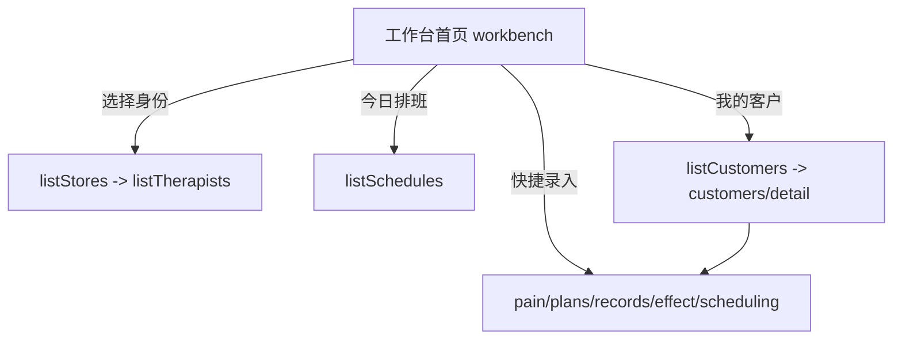

## 用户需求

在 mp-taro 小程序新增「调理师工作台」聚合首页，并将全部现有的健康数据中台（mt）页面接入小程序路由，使工作台及其跳转链路可正常访问。

## 产品概述

调理师工作台是健康数据中台面向连锁门店调理师/健康顾问的统一工作入口。首页聚合调理师身份选择、今日排班与日程、我的客户列表、快捷录入入口，调理师无需在多个页面间来回切换即可完成日常排班查看、客户跟进与各类评估/记录录入。

## 核心功能

- 工作台首页聚合：调理师身份选择/切换（复用门店→调理师两级选择，身份存 Storage），顶部展示当前调理师与门店信息。
- 今日排班与日程：调用 listSchedules 拉取排班，按 work_date 过滤出今日，卡片展示时段（上午/下午/晚上）、起止时间、名额与状态。
- 我的客户列表：调用 listCustomers 展示客户卡片（姓名脱敏、授权状态），点击进入客户详情页（detail）进行各项录入。
- 快捷录入入口：一键跳转至疼痛评估、照护计划、治疗记录、效果四档、排班与标签等已有 mt 页面，URL 模式复用 /pages/mt/xxx/index?customer_id=...。
- 路由接入：将 9 个 mt 页面（customers、customers/detail、pain、plans、records、effect、risk、repurchase、scheduling）+ 新增工作台页全部登记到 app.config.ts 的 pages 数组。

## 技术栈

- 框架：Taro 3 + React + TypeScript（与现有 mp-taro 工程一致）
- 样式：沿用现有 mt 页面约定（内联 style + className 'mt-*'：mt-page/mt-card/mt-form/mt-input/mt-btn/mt-label/mt-tip/mt-link/mt-tag 等），不引入新 UI 库
- 服务层：复用 `src/services/mt.ts`（listStores/listTherapists/listSchedules/listCustomers 已就绪，无需改动）
- 路由：修改 `src/app.config.ts` 的 pages 数组登记页面

## 实现方案

### 策略

新增 `src/pages/mt/workbench/index.tsx` 作为调理师工作台首页，参照 `doctor-workbench` 的身份选择器 + 卡片统计 + 列表模式；身份（therapistId）存 `Taro.getStorageSync('therapistId')`，通过 listStores→listTherapists 两级 Picker 选择。首页聚合四区块：身份信息条、今日排班、我的客户、快捷录入。同时将全部 mt 页面与工作台页登记进 `app.config.ts`。

### 关键技术决策

- **身份选择复用 doctor-workbench 范式**：保持工程内一致性，降低维护成本；Storage key 用 `therapistId`（与 `doctorId` 区分，避免冲突）。
- **今日排班过滤**：listSchedules 拉取后前端用 `new Date().toISOString().slice(0,10)` 比对 work_date 过滤，避免新增后端参数；数据量小（page_size 20），前端过滤无性能问题。
- **我的客户用全量 listCustomers**：当前服务层无 therapist 维度过滤接口，先用全量列表（与现有 customers/index 一致），卡片点击进 detail 页；不做过度设计。
- **快捷录入入口复用 detail 页已有 URL 模式**：`/pages/mt/pain/index?customer_id=ID` 等，保证跳转链路与现有页面一致，不新造导航。
- **路由全量接入**：app.config.ts pages 数组补齐 9 个 mt 页面 + 工作台页，使 navigateTo 链路可用；保持原有 ih 页面不动，控制改动半径。

### 性能与可靠性

- 列表分页 page_size=20，避免一次拉取过多；首屏并行加载 stores/therapists/schedules/customers，失败各自 catch 不影响其他区块。
- 身份未选时展示选择态（参考 doctor-workbench 的 picking 分支），不触发空请求。
- 所有请求错误用 `Taro.showToast` 提示，不抛未捕获异常。

## 实现注意事项

- 复用 `services/mt.ts` 现有导出，不新增 API 封装。
- 新页面 className 严格沿用 `mt-*` 约定，不引入新样式类名体系。
- 工作台页本身也需登记进 app.config.ts pages（路径 `pages/mt/workbench/index`）。
- 保持 `doctor-workbench` 等现有页面不变，仅新增 + 路由登记，避免回归。

## 架构设计

### 页面关系



工作台为聚合入口，其余为既有页面，跳转链路通过 app.config.ts 登记后打通。

## 目录结构

```
code/mp-taro/src/
├── app.config.ts                    # [MODIFY] pages 数组新增 9 个 mt 页面 + 工作台页，打通路由
└── pages/mt/
    ├── workbench/
    │   └── index.tsx                # [NEW] 调理师工作台首页。实现身份选择/切换（Storage therapistId）、今日排班过滤展示、我的客户列表、快捷录入入口跳转；复用 mt-*  className 与 services/mt.ts
    ├── customers/index.tsx          # [不变，仅路由登记]
    ├── customers/detail.tsx         # [不变，仅路由登记]
    ├── pain/index.tsx               # [不变，仅路由登记]
    ├── plans/index.tsx              # [不变，仅路由登记]
    ├── records/index.tsx            # [不变，仅路由登记]
    ├── effect/index.tsx             # [不变，仅路由登记]
    ├── risk/index.tsx               # [不变，仅路由登记]
    ├── repurchase/index.tsx         # [不变，仅路由登记]
    └── scheduling/index.tsx         # [不变，仅路由登记]
```

## 关键代码结构（复用现有类型，无需新定义）

- 复用 `services/mt.ts` 中：`Therapist`、`Store`、`Schedule`、`Customer` 接口及 `listStores`、`listTherapists`、`listSchedules`、`listCustomers` 函数。
- 工作台页状态：`therapistId`（Storage）、`stores`、`therapists`、`schedules`、`customers`、`picking`。

## 设计风格

沿用现有 mp-taro 中台页面风格（白底卡片 + 圆角阴影 + 蓝色主调 + mt-* className），保持工程内视觉一致。工作台首页采用纵向区块式布局：顶部身份条（蓝绿渐变，复用 profile 页样式）→ 今日排班卡片行 → 我的客户列表 → 快捷录入宫格。整体简洁、信息密度适中，适合门店调理师日常高频使用。

## 页面区块规划（工作台首页，单页）

1. 顶部身份条：展示调理师姓名/门店，右侧「切换账号」按钮（参考 doctor-workbench）。
2. 今日排班区块：标题「今日排班」+ 横向/纵向卡片展示时段、起止时间、名额、状态标签；无排班显示空态提示。
3. 我的客户区块：标题「我的客户」+ 客户卡片列表（脱敏姓名、授权状态标签），点击进详情。
4. 快捷录入区块：宫格按钮（疼痛评估/照护计划/治疗记录/效果四档/排班标签），点击 navigateTo 对应页面。
5. 身份选择态：未选调理师时，列表展示门店→调理师 Picker 供选择（参考 doctor-workbench picking 分支）。