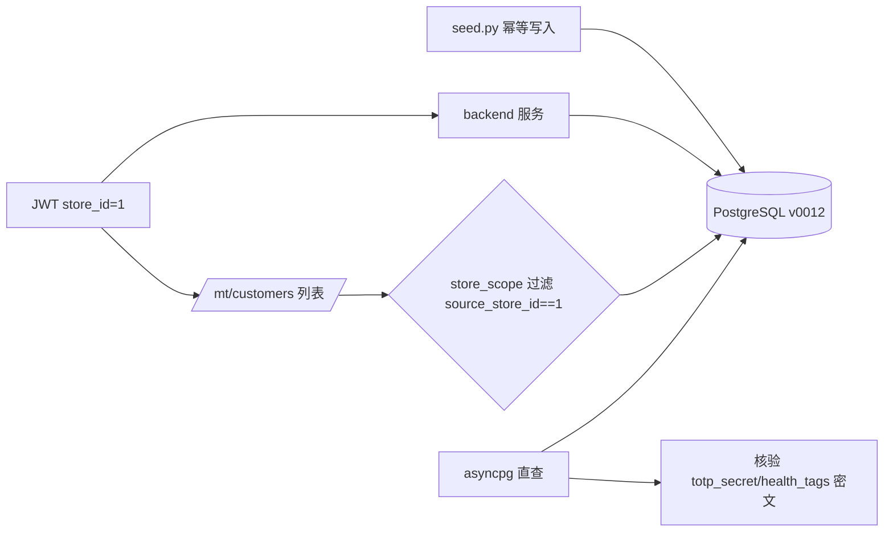

## 用户需求

按照既定"建议顺序"执行第一步（内部可立即开展的部分）：消除《整体进度与下一步计划》第六章风险 1/2/8（运行时未验证），将"代码级完成"升级为"运行时验证完成"。

## 产品概述

对互联网医疗中心平台后端执行一次真实 PostgreSQL 运行时验证：注入幂等种子数据、启动后端服务、以门店角色 JWT 真实联调 RLS（应用层 store_id 隔离）、核验落库加密字段确为密文。

## 核心功能

- 运行 seed 脚本注入门店/调理师/AI模型/数据资产/药师/后台账号等演示数据（幂等，可重复执行）。
- 启动 backend 服务（处理 Redis 限流依赖，确认不可用自动放行或本地起 Redis）。
- 构造 store 角色 JWT（携带 store_id），真实调用 /api/v1/mt/customers 等接口，断言跨门店数据隔离生效。
- 直连 PG 验证 plat_account.totp_secret 为密文（非 base32 明文）、mt_customer.health_tags 为加密文本。
- 清理临时探查脚本，保持工作区整洁。

## 技术栈

- 后端：Python 3.11 + FastAPI + SQLAlchemy 2.0（Async）+ Alembic（既有栈）。
- 运行时：Docker pgvector Postgres 容器（ihm-postgres，5432，已 healthy），默认 postgres_uri 与容器一致。
- 加密：app.core.kms（本地信封加密）+ encrypted_field（EncryptedString/EncryptedJSON，ORM 透明加解密，已落地）。
- 鉴权：app.core.security.create_access_token（HS256，带 store_id 声明）+ deps.require_role + store_scope 依赖。

## 实现方式

策略：在已就绪的真实 PG（v0012）上跑 seed → 起 backend → 用脚本签发 store 角色 JWT 调用受 RLS 保护的 mt 接口验证隔离 → 直连 PG 核验加密列密文。全部复用现有模块，不新增业务代码，仅新增一个临时验证脚本（执行后删除）。

关键决策与依据：

1. seed 幂等（_upsert_* 已存在则跳过），对 v0012 库直接运行安全，不会产生重复数据或冲突。
2. RLS 为应用层 store_id 过滤（非 DB 原生策略）：deps.store_scope 从 JWT 取 store_id 注入查询条件（customers.py:48、treatment_records.py:55、stores.py:68）。验证时只需签一个绑定 store_id 的 JWT 调列表接口，断言返回结果的 source_store_id 全部等于该值，即证明隔离生效。
3. 限流依赖 Redis（rate_limit_enabled=True）：后端代码注释明确"Redis 不可用时自动放行"，故无需强制起 Redis 即可验证；若本地有 docker 则顺带起 redis 容器更贴近生产。计划以"自动放行"为默认路径，避免引入额外依赖阻塞。
4. 加密核验：直接 asyncpg 查 plat_account.totp_secret / mt_customer.health_tags 原始值，确认非可识别明文（KMS 密文为 base64(JSON) 结构，含 nonce/wdek/ct 字段）。这是进度文档第六章风险 8（落库加密是否真生效）的运行时证据。

性能与可靠性：seed 为少量演示数据（~3 门店 + 6 调理师 + 3 模型 + 4 资产 + 2 药师 + 4 账号），写入耗时可忽略；RLS 联调为单接口查询，无性能负担；验证脚本为一次性，不进提交。

## 实现要点

- 复用 app.db.seed.seed_all（asyncio.run 驱动）。
- 复用 app.core.security.create_access_token 构造带 {"sub":1,"role":"store","store_id":X} 的 JWT；必要时复用 auth 路由 dev-token 白名单签发。
- 验证脚本用 httpx.AsyncClient 走 ASGI（或直接 urllib 调 localhost:8000），避免 curl 中文编码坑（历史经验）。
- 加密核验脚本用 asyncpg 直连，只读 SELECT，不改数据。
- 临时文件（_probe_db.py、verify_rls.py 等）验证完成后删除，不进 git。

## 架构设计

验证链路：seed（写 PG）→ backend（起服务）→ JWT(store_id) → mt 接口（store_scope 注入过滤）→ PG 查询隔离；旁路 asyncpg 直查验证加密列。



## 目录结构

```
code/backend/
├── app/db/seed.py              # [已有] 幂等种子，本次直接运行，不改动
├── app/core/security.py        # [已有] create_access_token，复用以签发 store JWT
├── app/core/deps.py            # [已有] store_scope / require_role，RLS 隔离依赖，不改动
├── app/api/v1/mt/customers.py  # [已有] 受 RLS 保护接口，作为联调目标，不改动
├── scripts/verify_runtime.py   # [NEW] 一次性验证脚本：seed + 签 JWT + 调接口断言隔离 + 直查加密列；执行后删除
└── _probe_db.py                # [TEMP] 已存在的临时探查脚本，验证完成后删除
```

## 关键代码结构

无需新增接口或类型；验证脚本仅调用既有函数：

- `app.core.security.create_access_token(subject, role, store_id) -> str`
- `app.db.seed.seed_all() -> dict`（幂等）
- `app.core.deps.store_scope` 依赖（从 JWT 取 store_id 注入查询）