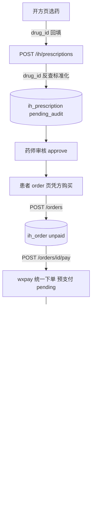

## 用户需求

执行迭代 A 的 S3 / S4 / S5 三块并行开发：

- **S3 处方按患者过滤（修复越权风险）**：当前 `GET /ih/prescriptions` 与 `GET /ih/prescriptions/{id}` 无任何归属校验，任意登录用户可拉取/查看他人处方，属严重越权。需按角色做数据隔离：患者仅看自己处方、医师仅看自己开的、药师/平台可看全部或按状态过滤。
- **S4 药品联动**：开方页 `doctor-rx-create` 目前医师手填药品名称/规格，未从药品目录选药。需实现开方选药联动——从 `listDrugs` 真实药品目录选药后自动回填规格/类型/单价，并记录 `drug_id`，后端开方时反查标准化。
- **S5 微信支付（规范化预支付+回调骨架）**：当前 `pay_order` 为占位（直接落 paid）。需建立预支付单、统一支付状态机、微信支付回调验签骨架与商户配置项（mch_id/v3key/证书等走 env 注入），dev 用沙箱/模拟回调跑通链路。

## 产品概述

打通「开方 → 选药联动 → 药师审核 → 凭方购药（规范化支付）→ 支付结果闭环」的最小可演示业务闭环，并修复处方越权这一等保三级合规风险点。

## 核心特性

- S3：处方列表/详情按角色归属过滤，杜绝越权查看；patient 仅本人、doctor 仅本人开方、pharmacist/platform 全量。
- S4：开方页支持从真实药品目录选药并自动回填，记录 drug_id；后端按 drug_id 反查标准化规格/类型入 items_json。
- S5：支付状态机（pending→paid/closed）；预支付返回 prepay 参数；回调验签骨架 + 模拟回调端点跑通闭环；前端接 requestPayment 调起。

## 技术栈选型

- 后端：Python FastAPI + SQLAlchemy 2.x（异步）+ Alembic（沿用现有栈，不引入新依赖）
- 前端小程序：Taro(React) + TypeScript（沿用现有栈）
- 鉴权：JWT（HS256）+ RBAC；统一响应体 `code/message/data`（HTTP 200 + 业务码）
- 微信支付：APIv3 JSAPI 调起 + 回调验签骨架（dev 沙箱开关，真实商户参数 env 注入）
- 验证：dev-token + Python urllib 真联调（规避 curl 编码坑）

## 实现方法

采用「先后端越权修复与支付骨架，再前端联动与调起，最后统一重启联调」的顺序，避免契约漂移。

### 关键技术决策

1. **S3 角色归属过滤**：`list_prescriptions` 与 `get_prescription` 依据 `current_user` 的 role + `actor_of(sub)` 注入归属条件。patient→`patient_id==sub`；doctor→`doctor_id==sub`；pharmacist/platform→不限（pharmacist 审方需看全量，S2 已依赖）；platform→全量。额外提供 `patient_id` query 仅 platform 可显式指定（越权防护）。`get_prescription` 越权返回 `FORBIDDEN(2003)` 或 `RESOURCE_NOT_FOUND(3004)`。沿用 `require_role`/`actor_of`/`ROLES`，不新增鉴权抽象。
2. **S4 药品联动**：前端开方页新增「从药品目录选药」入口，复用 `listDrugs`（`drug-catalog` 已验证可用），选中后经页面栈回传（Taro `getCurrentPages` + `navigateBack` 或 Storage 暂存）回填 item 的 name/spec/otc_type/unit/price 并带 `drug_id`。后端 `create_prescription` 用 `items[].drug_id` 反查 `IhDrug`，将 spec/otc_type 等标准化进 `items_json`（避免手填不一致）；处方药保留 `pending_audit` 链路。前端 `PrescriptionItem` 接口已含 `drug_id`，无需改 schema 契约。
3. **S5 支付状态机与预支付**：`IhPayment.trade_state` 引入 `pending/SUCCESS/REFUND/CLOSED` 枚举语义（表已支持）。`pay_order` 改为：创建/更新 IhPayment 为 `pending`，调用 `app/services/wxpay.py` 统一下单（dev 沙箱返回模拟 prepay_id + JSAPI 签名参数），返回前端调起所需字段；不再直接落 paid。新增 `POST /orders/wxpay/notify`（微信回调，`app/core/wxpay_verify.py` 验签骨架：HMAC-SHA256 签名校验 + AES-GCM 解密 resource，dev 沙箱可跳过真验签）更新状态。新增 `POST /orders/{id}/pay/mock-success` 供联调（dev 开关），驱动 `paid` 闭环。
4. **配置项**：`config.py` 新增 `wxpay_mch_id / wxpay_api_v3_key / wxpay_cert_serial / wxpay_notify_base_url / wxpay_appid / wxpay_dev_sandbox`，dev 占位、生产经 env 注入（不硬编码，符合等保三级）。
5. **前端支付调起**：`pages/order/index.tsx` 由「直接 payOrder」改为「创建订单 → payOrder 拿 prepay 参数 → Taro.requestPayment 调起 → 结果经 mock-success/notify 确认」；amount 从处方药品价格（S4 已带 price）汇总传入，解决当前 amount=0。

### 性能与可靠性

- S3 过滤为 SQL `WHERE` 条件叠加（O(1) 索引命中 `patient_id`/`doctor_id` 已有索引），无 N+1。
- S4 选药复用已缓存的 `listDrugs`（Redis cache-aside），无额外开销。
- S5 预支付单与订单同事务落库；回调幂等（按 `transaction_id`/order_no 去重），防重复到账。
- 不引入新依赖；统一响应体结构不变；`--reload` 对 config/orders 改动需手动重启（S5 联调必重启）。

## 实现注意（防回归）

- **角色归属单一来源**：S3 的 role→filter 映射集中在 `prescriptions.py` 内，与 `deps.ROLES` 保持一致；不散落硬编码。
- **向后兼容**：`list_prescriptions` 默认行为对 patient 收紧，但旧调用（前端 prescription 页）因 JWT sub 即 patient_id 自动生效，无需改前端传参；`patient_id` query 仅 platform 生效，避免被普通用户越权指定。
- **审计链**：S5 支付状态流转（prepay/paid）均 `write_audit`，actor 取 JWT 主体；敏感信息（证书/key）不打印日志。
- **范围控制**：S5 不做真实商户直连（无凭证），仅骨架+沙箱；不实现退款流水、不接 P2 其他渠道。
- **勿整文件覆盖**：改 service/页面前必 read 确认已存在内容，避免误覆盖致 TS 报错。

## 架构设计

沿用现有分层（路由层 / 依赖注入 / 模型 / schema / 服务），仅新增支付服务与验签模块，不改架构。



## 目录结构与改动点

```
code/backend/
├── app/core/config.py                 # [MODIFY] 新增 wxpay_* 配置项（mch_id/v3key/cert_serial/notify_url/appid/dev_sandbox）
├── app/core/wxpay_verify.py          # [NEW] 微信支付回调验签骨架（HMAC-SHA256 + AES-GCM 解密；dev 沙箱跳过真验签）
├── app/services/wxpay.py             # [NEW] 统一下单/签名服务（dev 沙箱返回模拟 prepay_id + JSAPI 参数）
├── app/api/v1/ih/prescriptions.py    # [MODIFY] list/get 按 role 归属过滤（S3 越权修复）
├── app/api/v1/ih/orders.py           # [MODIFY] pay_order 改预支付状态机；新增 /wxpay/notify、/id/pay/mock-success
├── app/models/ih_models.py           # [确认] IhPayment 已含 trade_state/prepay_id/transaction_id，无需改表
└── app/schemas/ih.py                 # [确认] OrderPayIn/pay 响应结构，按需补充 prepay 返回体

code/mp-taro/
├── src/services/ih.ts                 # [确认/MODIFY] PrescriptionItem 含 drug_id；listDrugs 已有；payOrder 返回 prepay 参数类型
├── src/pages/doctor-rx-create/index.tsx  # [MODIFY] 从药品目录选药回填 drug_id/spec/otc_type/price
├── src/pages/drug-catalog/index.tsx     # [MODIFY/复用] 支持「选药模式」回传选中药品（页面栈/Storage）
└── src/pages/order/index.tsx            # [MODIFY] 接 Taro.requestPayment 调起；amount 由处方药价汇总；支付结果确认
```

## 关键验证清单（Python urllib 联调 + 前端 tsc）

1. S3：patient A token 列处方仅含自己；patient B token `GET /ih/prescriptions/{A的id}` → 2003/3004。
2. S3：doctor token 列表仅含 `doctor_id==sub`；pharmacist/platform 全量可见。
3. S4：`listDrugs` 有数据；开方选药带 `drug_id` 成功，`items_json` 含标准化 spec/otc_type。
4. S5：创建 rx 订单 → `pay_order` 返回 prepay_id 且 `IhPayment.trade_state=pending`。
5. S5：`POST /orders/{id}/pay/mock-success` → order.paid + IhPayment SUCCESS + transaction_id 落库。
6. S5：回调验签骨架在 dev 沙箱可跳过真验签直接跑通。
7. 前端 `tsc --noEmit` 通过；重启后端（config/orders 改动）后全链路联调。
8. 提交推送。

## Agent Extensions

### SubAgent

- **code-explorer**
- Purpose: 在实现各步骤前精确核对端点签名、前端 service 字段、wxpay 既有模式与契约，避免误覆盖与契约漂移
- Expected outcome: 每次修改前返回准确的现有代码结构与端点定义，保障改动精准、零回归